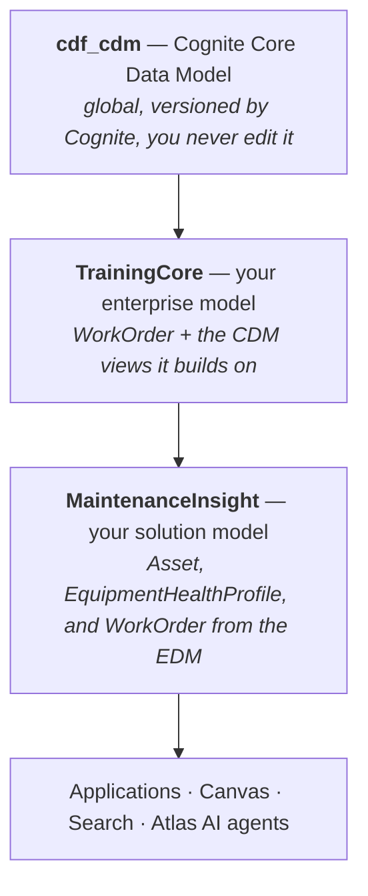
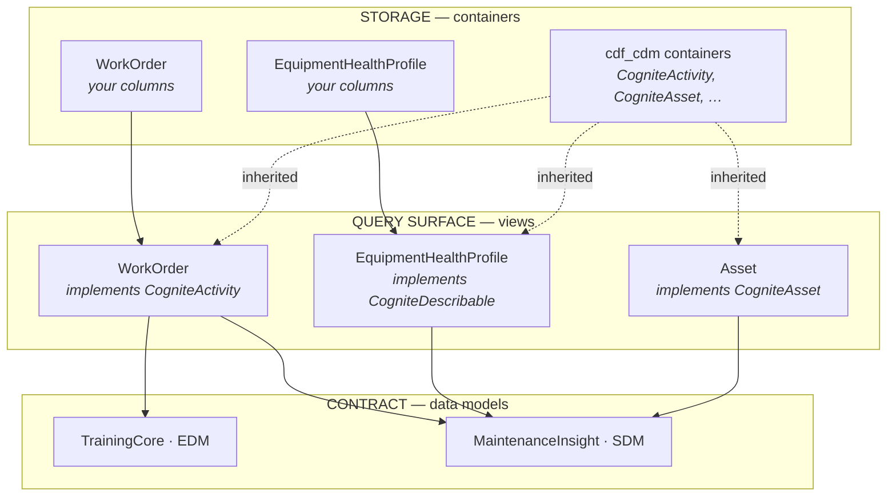
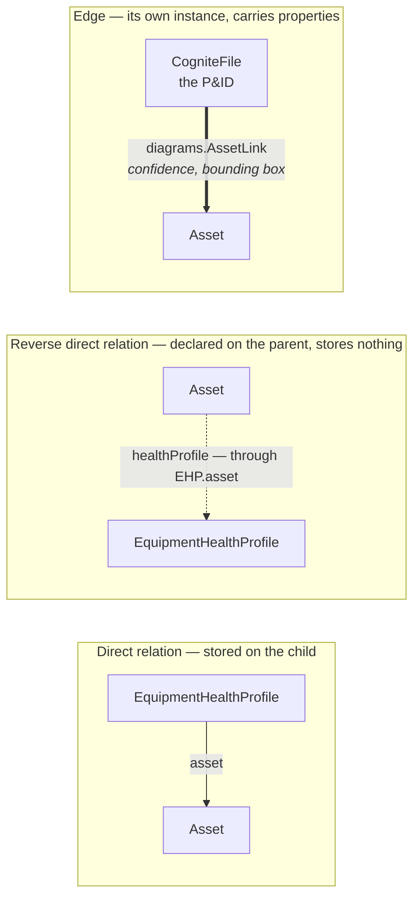

# Chapter 03 — Data Modeling

**Goal:** understand *why* this lab's data model is shaped the way it is — not just
copy YAML — then author every data-modeling resource for your own module.

This is the longest chapter in the course on purpose. Everything downstream
(transformations, functions, location filters) exists to populate or scope the model
you build here.

---

## 3.1 [INFO] Problem framing — what graph are we actually building?

An industrial question like *"why is pump* `21-PA-2001A` *degrading, and what should we
do about it?"* requires walking a graph, not querying a table:

```
Asset hierarchy (where is it?)
  → Equipment (what physical thing is installed there?)
    → TimeSeries (what are its sensors saying, over time?)
    → Files / Diagrams (what P&ID and datasheet describe it?)
    → WorkOrders (what maintenance has been done or is planned?)
    → 3D (where does it sit physically?)
    → EquipmentHealthProfile (the derived, human-readable rollup)
```

No single classic resource type (assets, time series, events) answers this alone —
you need a model that lets all of these *reference each other* through relations. That
is what data modeling in CDF is for: not storage, but **navigable structure**.

---


## 3.2 [INFO] Why spaces — instance vs schema

A **space** is a namespace for either data (*instance space*) or schema (*schema
space*). This lab uses three, and the split is deliberate:


| Space                                 | Kind           | Holds                                                                       |
| ------------------------------------- | -------------- | --------------------------------------------------------------------------- |
| `isp_YOURNAME_TRN`                    | Instance space | Your actual nodes/edges: assets, equipment, time series, files, work orders |
| `ssp_YOURNAME_TrainingCore_edm`       | Schema space   | Your enterprise container + view + data model definitions                   |
| `ssp_YOURNAME_MaintenanceInsight_sdm` | Schema space   | Your solution container + view + data model definitions                     |


**Why separate instance from schema at all?** Schema (containers/views/models) changes
rarely and needs careful versioning; instances (actual data) change constantly and
need none. Mixing them in one space means every data write and every schema change
compete for the same namespace's access rules and lifecycle. Separating them means you
can, for example, purge all your instance data (teardown, [Chapter 17](17-cross-cutting-mastery.md))
without touching your schema at all.

**Why three spaces and not one?** Because *isolation* in this course is achieved
**by space**, not by scoping every external ID (section 1.2). If everyone shared one
instance space, `21-PA-2001A` would collide across all participants immediately. Each
person's own `isp_YOURNAME_TRN` is what makes 15 identical builds coexist.

⚠️ `[COMMON MISTAKE]` Putting instance data in a schema space "because it's already
there." CDF won't stop you, but it defeats separated lifecycle management and is not
how this course — or most production CDF deployments — are structured.

📚 `[DOCS]` [https://docs.cognite.com/cdf/dm/](https://docs.cognite.com/cdf/dm/) (spaces, containers, views, data models)

---


## 3.3 [INFO] Why `cdf_cdm` + EDM + SDM layering (not a fully custom model)



Dependencies point one way only. A solution model may reach up into the enterprise model;
an enterprise model must never depend on a solution model, or every solution becomes a
release blocker for every other.

**Design decision log — read this before touching YAML:**


| Choice made                                                                                                                                                           | Alternative considered                              | Why rejected                                                                                                                                                                                                                                                                         |
| --------------------------------------------------------------------------------------------------------------------------------------------------------------------- | --------------------------------------------------- | ------------------------------------------------------------------------------------------------------------------------------------------------------------------------------------------------------------------------------------------------------------------------------------ |
| Extend `cdf_cdm` (Cognite's Core Data Model); author exactly **one** enterprise view (`WorkOrder`) + **one** solution view (`EquipmentHealthProfile`) | Fully custom, green-field data model (no CDM reuse) | Too slow to build in a 4-hour lab, and it throws away CDM's built-in contextualization machinery (diagram annotations, 3D linking, entity matching all assume `CogniteAsset`/`CogniteEquipment`/`CogniteFile` shapes). You'd be re-inventing plumbing this course wants you to *use* |
| Two data models: broad **enterprise** (`TrainingCore`) vs narrow **solution** (`MaintenanceInsight`) that reuses enterprise views by reference        | One data model for everything                       | A single model can't demonstrate the enterprise/solution contrast that's the actual teaching point — see section 3.4                                                                                                                                                                        |
| Location filter points at the **solution** model, not the enterprise model                                                                                            | Point the location filter at the enterprise model   | Would expose the *entire* broad surface to end users instead of the one curated use case — see [Chapter 06](06-location-filters.md)                                                                                                                                                  |


**What "extending CDM" means concretely:** every view in this model either *is* a CDM
view unchanged (`CogniteAsset`, `CogniteEquipment`, `CogniteTimeSeries`, `CogniteFile`,
`Cognite3DObject`, …) or *implements* one, inheriting its properties and adding a few
of your own. You only author net-new schema where CDM genuinely has no equivalent:
SAP work-order fields, and the derived Equipment Health Profile rollup.

**When to fork CDM instead of extending it:** if your domain concept has *no*
reasonable CDM parent (rare — CDM's core types are intentionally broad) or you need
incompatible semantics on a property CDM already defines. Neither applies here.

📚 `[DOCS]` Core Data Model reference — fetch the current page from
[https://docs.cognite.com/llms.txt](https://docs.cognite.com/llms.txt) (search "Core Data Model") before relying on
property names from memory; the CDM evolves between Toolkit versions.

---


## 3.4 [INFO] Why two data models, not one — enterprise vs solution

💡 `[GOOD TO KNOW]` Two small things about a `DataModel.yaml` that are easy to miss:

- **`views:` is a set, not a sequence.** Order it for the next person reading the YAML —
  your own views first, then the CDM views they build on — but do not *rely* on that
  order. DMS does not preserve it: retrieve the model back and the list returns in an
  order of the API's choosing, the same every time but not the one you wrote. If you
  need a guaranteed presentation order, it belongs in the application, not the model.
- **Version strings.** This course uses `v1.0.0`. Cognite's own guidance prefers
  `v1_0_0` — underscores rather than dots, because some YAML parsers treat a dotted
  string as a number and silently reformat it. Either works; know that you will meet
  both, and never hand-edit a version without also updating every view reference and
  transformation that names it.


|                                     | `TrainingCore` (**enterprise**)                  | `MaintenanceInsight` (**solution**)                                             |
| ----------------------------------- | -------------------------------------------------------- | --------------------------------------------------------------------------------------- |
| Audience                            | Broad — every consumer of this domain's data             | One use case: "Rotating-Equipment Maintenance Insight"                                  |
| Views                               | 10 CDM views + `WorkOrder`                       | 6 CDM views + `WorkOrder` (**by reference**) + `EquipmentHealthProfile` |
| Includes 3D CAD views?              | Yes (`Cognite3DObject`, `CogniteCADModel/Revision/Node`) | No — out of scope for this use case                                                     |
| Who points a Location Filter at it? | Nobody, in this lab                                      | Your Location Filter ([Chapter 06](06-location-filters.md))                             |


The solution model **reuses** the enterprise `WorkOrder` by reference rather
than redefining it — a view is identified by `(space, externalId, version)`, so a
solution model can simply list an enterprise view in its own `views:` array. This is
the actual mechanic behind "layering": solution models compose enterprise + CDM
views, they don't duplicate them.

**The contrast is the lesson.** In production, the enterprise model is the broad,
governed surface that many teams build on; solution models are narrow, opinionated
products built *from* enterprise views for one audience. Building both, even in a toy
lab, is what makes the difference legible instead of theoretical.

---


## 3.5 [INFO] Why containers vs views vs data models — three different jobs



A container holds columns. A view is what you query. A data model is the published list of
views an application binds to. Data lives in exactly one place — the container — no matter
how many views expose it.

ℹ️ `[INFO]` **Naming, before you write a single file.** CDF data modeling has one
convention and this course follows it, because every Cognite-authored model you will
ever read uses it:

| Thing | Case | Examples |
|---|---|---|
| Container external ID | **PascalCase** | `WorkOrder`, `EquipmentHealthProfile`, `CogniteAsset` |
| View external ID | **PascalCase** | `WorkOrder`, `EquipmentHealthProfile` |
| Data model external ID | **PascalCase** | `TrainingCore`, `MaintenanceInsight` |
| Every property | **camelCase** | `workOrderNumber`, `ratedFlowM3h`, `openWorkOrderCount` |
| Space | your own scheme | `isp_<YOURNAME>_TRN` — spaces are not part of this convention, and here they carry your isolation |

💡 `[GOOD TO KNOW]` A container and a view **may share an external ID**, and usually
should. `WorkOrder` the container stores the properties; `WorkOrder` the view exposes
them. They are different resource types in different namespaces, so there is no clash —
this is exactly what CDM does with `CogniteAsset`.

⚠️ `[COMMON MISTAKE]` Encoding the resource type in the ID — `con_WorkOrder`,
`viw_WorkOrder_edm`. It reads well in a flat file list and badly everywhere else: in
Fusion, in a query, in an agent's prompt. The file name already carries the type
(`WorkOrder.Container.yaml`). The external ID should carry the meaning.


| Layer          | Job                                                                                                                                       | Analogy                               |
| -------------- | ----------------------------------------------------------------------------------------------------------------------------------------- | ------------------------------------- |
| **Container**  | Storage contract: property types, nullability, constraints, indexes                                                                       | A database table's column definitions |
| **View**       | Read/query contract: which container properties are exposed, under what names, optionally inheriting from a parent view via `implements:` | A SQL view / API shape                |
| **Data model** | Published product surface: a named, versioned collection of views                                                                         | An API version you hand to consumers  |


Splitting these matters because they **change at different rates and for different
reasons**: you might add an index to a container without changing any view; you might
publish a new data-model version exposing an existing view differently without
touching the container at all. Versioning the *data model* (and view) independently
from the *container* is a change-management tool, not bureaucracy — it's what lets
you evolve a published product without breaking every consumer on day one.

**Why** `implements:` — `WorkOrder` implements `CogniteActivity`:

```yaml
implements:
  - space: cdf_cdm
    externalId: CogniteActivity
    version: v1
    type: view
```

This is inheritance for free: `name`, `description`, `assets` (the relation to the
equipment/asset it's performed on), and CDM's scheduling fields
(`scheduledStartTime`, etc.) all come from `CogniteActivity` without you redefining
them. You only add the properties CDM has no equivalent for: `workOrderNumber`,
`status`, `orderType`, `priority`, `actualCost`, `currency`, `sourceSystem`. This is
the concrete mechanism behind "extend, don't fork" from section 3.3.

---


## 3.6 [INFO] Nodes, edges, and files as instances

- **Nodes** are the primary instance type: assets, equipment, time series metadata,
work orders, the Equipment Health Profile — anything with properties.
- **Edges** connect two nodes with their own properties. `CogniteDiagramAnnotation`
(Chapter 08) is an edge: it connects a file node to an asset node and carries the
bounding box and confidence score of *that specific match* — properties that belong
to neither node alone.
- **Files** are a hybrid: `CogniteFile` is a DMS node (has a space+externalId
identity, participates in views like any other node) *and* has binary content
attached via the classic Files API underneath. That dual nature is why file
external IDs get `YOURNAME`-scoped (section 1.2) even though other node external IDs don't.

**Why relations/edges matter for this lesson specifically:** the entire "hero tag"
story (`21-PA-2001A` as the hub everything converges on) *is* a set of direct
relations and edges: `Equipment.asset → Asset`, `TimeSeries.assets → [Asset]`,
`WorkOrder.assets → [Asset]`, `DiagramAnnotation edge: File → Asset`,
`EquipmentHealthProfile.asset/equipment/datasheetFile → [Asset, Equipment, File]`.
Nothing here is a copy of data — it's all navigable references into the same handful
of nodes.

---


## 3.7 [OPTIMIZE] Search, indexing, and property choices

The first two physical-design features you'll use in `WorkOrder` are:

```yaml
constraints:
  uniqueWorkOrderNumber:
    constraintType: uniqueness
    properties: [workOrderNumber]
indexes:
  statusIndex:
    indexType: btree
    properties: [status]
```

- **Uniqueness constraints** prevent duplicate business keys from ever being written —
cheaper to catch at write time than to detect and dedupe later.
- **B-tree indexes** speed up equality/range filtering on that property (`status = 'OPEN'`) at query time — without one, that filter is a full scan of the container.

The index type must match the access pattern:

| Query shape | Physical design |
|---|---|
| Equality, range or sort on one or more scalar properties | **B-tree** index |
| Membership search inside a list property | **Inverted** index |
| Stable pagination with a custom sort | A **cursorable B-tree** whose property order matches the sort |

An index belongs to a **container**, not to a view and not to a property in isolation.
That has two consequences senior reviewers look for:

1. A composite index can only contain properties stored in the same container. A view
   assembled from three containers cannot acquire one cross-container index.
2. You can tune only containers you own. `WorkOrder.assets` is inherited from
   `cdf_cdm:CogniteActivity`; this course cannot add an index to Cognite's container.
   If asset → work-order lookup is a hard latency/SLA requirement at production scale,
   model that relationship as an edge you own instead of depending forever on reverse
   membership filtering over a CDM list.

⚠️ `[COMMON MISTAKE]` Using a B-tree for a list because the query uses equality-like
language. Lists use **inverted** indexes. B-trees are for primitive scalar lookups and
range scans. List properties also need a deliberate `maxListSize`; an unbounded
many-to-many relationship is usually an edge trying to escape from a property.

⚠️ `[COMMON MISTAKE]` Indexing every property "to be safe." Indexes cost write
throughput and storage; add them for properties you know you'll filter or sort on
(here: `status`, because dashboards and workflows will query "give me all `OPEN`
work orders"), not speculatively.

💡 `[GOOD TO KNOW]` Creating an index returns before the index is necessarily usable.
Read the container back and check the index `state`: `pending` means it is still
building, `current` means the planner can use it, and `failed` means it cannot. Fix the
data that prevented the build and explicitly retry it; a failed index does not repair
itself. A green deploy is therefore not the same thing as a green physical design.

### The `requires` constraint — the one everybody forgets

There is a third constraint type, and it is the one with the biggest effect on query
speed. `requires` points at another container and says: *an instance with data here
must also have data there.*

```yaml
constraints:
  requiresCogniteActivity:
    constraintType: requires
    require:
      space: cdf_cdm
      externalId: CogniteActivity
      type: container
```

**The rule, and it is worth making a habit:** whenever a view implements another view,
put a `requires` constraint on its container pointing at the implemented container.
Your `WorkOrder` view implements `CogniteActivity`, so `WorkOrder` the *container*
requires `CogniteActivity` the *container*.

⚡ `[OPTIMIZE]` Why it matters: when you query a view that maps several containers, the
engine has to JOIN them. A `requires` constraint is a **guarantee** the data is
co-located, so the planner can drop a JOIN instead of performing one. On eight work
orders you will never measure it. On eight million you will not survive without it.

💡 `[GOOD TO KNOW]` Constraints are **transitive**. If A requires B and B requires C,
you do not need A → C as well. One hop is enough.

### The other property attributes

You have used `nullable`. There are three more, and each has a trap:

| Attribute | What it does | The trap |
|---|---|---|
| `nullable: false` | The property is required | Every view that maps it must set it — including every transformation writing through an implementing view. On a deep hierarchy this multiplies fast |
| `immutable: true` | The value can never change after first write | The *only* way to change it later is to recreate the instance, or the container. Use it for genuinely fixed facts — `sourceSystem`, date of manufacture |
| `default value` | Used when you send NULL | Applies to **new** values only. Existing instances keep what they had |
| `autoIncrement` | API assigns the next integer | `int32`/`int64` only, and it makes your IDs non-reproducible — rarely what you want in a pipeline |

Your `WorkOrder` container sets `immutable: true` on `sourceSystem`: a record's
system of origin is a fact about history, and history does not get edited.

### Units belong on the property, not in the name

`ratedFlowM3h` tells a human the unit. It tells an application nothing. Attach the real
unit instead:

```yaml
ratedFlowM3h:
  type:
    type: float64
    list: false
    unit:
      externalId: volume_flow_rate:m3-per-hr
  nullable: true
```

🚧 `[LIMITS]` Units attach to **`float32` and `float64` only**. If you want a unit on a
value that happens to be whole numbers, store it as a float anyway.

⚠️ `[COMMON MISTAKE]` Inventing the unit external ID. They come from a fixed catalog and
a wrong one fails at deploy. Look yours up:

```python
client.units.list(limit=-1)        # or search the catalog in the docs
```

📚 `[DOCS]` https://github.com/cognitedata/units-catalog/blob/main/versions/v1/units.json

---

💡 `[GOOD TO KNOW]` Property **names and descriptions are not just for humans**. In
[Chapter 10](10-datasheet-parsing.md) you'll see the Document Parser API treat a
view's property descriptions as the literal extraction schema an AI model fills in —
the same "write it clearly" discipline that helps a human skim a view in Fusion also
steers an agent's output. Model your properties assuming both audiences read them.

---


## 3.8 [INFO] Modeling anti-patterns seen in this design (and the redesign)


| Anti-pattern                                   | Why it's tempting                | What this lab does instead                                                                                                       |
| ---------------------------------------------- | -------------------------------- | -------------------------------------------------------------------------------------------------------------------------------- |
| Scope every instance externalId by participant | "Feels safer"                    | Scope the **space**, keep externalIds literal (section 1.2) — simpler, and it's what makes identical files possible across participants |
| One data model for everything                  | Fewer files to write             | Split enterprise/solution — the contrast between them is the actual lesson (section 3.4)                                                |
| Fork CDM instead of extending it               | Full control over every field    | Throws away built-in contextualization tooling for no benefit here (section 3.3)                                                        |
| Index every property                           | "Just in case we query it later" | Index only what you know you'll filter/sort on (section 3.7)                                                                            |
| A bare `hasData` filter to force instances to show up | The view is empty and you want it not to be | Populate the missing container. A standalone `hasData` filter is ignored by `/inspect`, so Canvas and Search disagree with your query (section 3.8b) |


---


### 3.8b The empty view — the trap that costs everyone an afternoon

You deploy a view, you populate it, and Fusion shows **0 instances**. Nothing errored.

> If no filter is specified, a default **`hasData`** filter is applied. There is an
> implicit **AND** across every container the view references — a node matches only if
> it has data in **all** of them.

Your `EquipmentHealthProfile` view implements `CogniteDescribable`, so it references two
containers: your own, and `cdf_cdm:CogniteDescribable`. A node carrying parsed datasheet
specs but no `name` has data in one of the two — so it does not match, and the view
looks empty even though the data is plainly there.

That is why the upsert in [Chapter 10](10-datasheet-parsing.md) writes `name` and
`description` alongside the specs. Not decoration — the difference between a view that
works and a view that is silently blank.

🟢 `[ACTION]` When a view looks empty, ask the registry rather than the view:

```python
from cognite.client.data_classes.data_modeling.instances import InvolvedContainers

client.data_modeling.instances.inspect(
    nodes=("isp_<YOURNAME>_TRN", "ehp_21-PA-2001A"),
    involved_containers=InvolvedContainers())      # required: say what to report
```

`inspect()` reports which containers the node actually populates, ignoring views
entirely. If the node is there but your view is not showing it, you have found your
`hasData` mismatch. [Chapter 13](13-querying-the-graph.md) section 13.7 does this hands-on.

---


### 3.8c What a write to an instance actually does — measured

Four questions decide whether your write code is correct, and all four are answered by
the same API behaviour. These were measured against a live project, not read off a page:

| You do this | What happens |
|---|---|
| Write a node, naming only some properties | Properties you did **not** name are left alone. `instances.apply` patches by default (`replace=False`) |
| Write a **list** property that already has values | The new list **replaces** the old one. It does not merge, append, or de-duplicate |
| Write an **empty list** to a list property | The relation is cleared. This is how you un-link something |
| Send **two entries for the same node** in one `apply` call | Rejected outright: `Duplicate node externalIds for space '...' present in request \| code: 400` |

Rows two and four together are the whole reason `MatchDocuments` in
[Chapter 07](07-entity-matching.md) does one read-modify-write per file rather than one
per link.

⚠️ `[COMMON MISTAKE]` Treating a direct-relation list as append-only — writing
`assets: [new_one]` and expecting the existing entries to survive. They do not. You must
read the current list, add to it, and write the whole thing back. The failure mode is
brutal precisely because it looks like success: your link appears in Fusion, and
somebody else's link, on the same file, is gone.

⚠️ `[COMMON MISTAKE]` Building a list of `NodeApply`s in a loop over *pairs* rather than
over *nodes*. Two pairs that share a source node produce two entries for that node, and
the whole call fails with a 400 that names a duplicate external ID — which reads like a
data problem and is actually a loop-shape problem.

---

## 3.9 [INFO] Connection properties — the four ways to link two things

You have used exactly one of these so far. There are four, they behave differently, and
picking the wrong one is the most expensive modeling mistake in this chapter — because
it only shows up later, as a query you cannot write.

| | Lives in | Reverse traversal | Can carry its own data | Use when |
|---|---|---|---|---|
| **Direct relation** | a container property | no | no | A simple pointer: this profile describes *that* asset |
| **List of direct relations** | a container property | **no** | no | One-to-many held on the child. Watch the size — past ~100 items, prefer an edge |
| **Reverse direct relation** | the **view only** | yes | no | You need to walk an existing direct relation *backwards* |
| **Edge** | its own instance | yes | **yes** | The relationship itself has properties, or you need both directions as first-class |



Solid arrows are stored data. The dotted arrow stores nothing at all — it is a declaration
that lets you walk the solid one backwards.

⚠️ `[COMMON MISTAKE]` Assuming a direct relation is traversable both ways because the
data "is there". It is not. `WorkOrder.assets` points at the pump, but `/query` cannot
walk that list property inwards from the pump. [Chapter 13](13-querying-the-graph.md)
section 13.5 shows you the exact error and the supported filter fallback.

### Reverse direct relations

A reverse direct relation is **not stored anywhere**. It is a declaration in a view that
says *"some other view points at me through this property — let me follow it backwards."*
Two consequences follow immediately:

- Adding one costs no storage and no re-ingestion. It is a pure schema change.
- It needs a **forward direct relation to exist first**. You cannot reverse what nothing
  points with.

Your `EquipmentHealthProfile` has `asset`, a direct relation to the pump. So an asset can
declare the reverse:

```yaml
healthProfile:
  connectionType: single_reverse_direct_relation
  source:                        # the view you end up in
    space: ssp_<YOURNAME>_MaintenanceInsight_sdm
    externalId: EquipmentHealthProfile
    version: v1.0.0
    type: view
  through:                       # the property doing the pointing
    source:
      space: ssp_<YOURNAME>_MaintenanceInsight_sdm
      externalId: EquipmentHealthProfile
      version: v1.0.0
      type: view
    identifier: asset
```

💡 `[GOOD TO KNOW]` `source` and `through.source` are the same view here, and usually
will be. `source` answers *"where do I land?"*; `through` answers *"along which
property?"*. They differ only when the property you traverse is declared on a view other
than the one you want back.

🚧 `[LIMITS]` `single_` versus `multi_` sets an **expectation, not a constraint** — the
value comes back as a list either way. If you genuinely need at most one, put a
uniqueness constraint on the forward direct relation. The name alone enforces nothing.

⚡ `[OPTIMIZE]` Index the direct relation you traverse `through`. Reversing an unindexed
relation is a scan, and it is the single most common cause of a view that is fast to
write and slow to read.

### Edge connections

[Chapter 08](08-diagram-annotation.md) writes edges of type `cdf_cdm:diagrams.AssetLink`
from the P&ID file to each asset it mentions. Those edges exist whether or not any view
mentions them — but nothing *discovers* them. An edge connection is the declaration that
makes them visible and traversable from a view:

```yaml
diagramAnnotations:
  connectionType: multi_edge_connection
  type:                          # the EDGE type, in cdf_cdm
    space: cdf_cdm
    externalId: diagrams.AssetLink
  source:                        # the view at the OTHER end
    space: cdf_cdm
    externalId: CogniteFile
    version: v1
    type: view
  edgeSource:                    # the view describing the EDGE's own properties
    space: cdf_cdm
    externalId: CogniteDiagramAnnotation
    version: v1
    type: view
  direction: inwards             # this asset is the END node
```

⚠️ `[COMMON MISTAKE]` Confusing the three view references. `type` is the edge's *type
node*, not a view. `source` is where you land. `edgeSource` is what the edge itself looks
like — for annotations, that is `CogniteDiagramAnnotation`, which is why the chapter
insists that view is the **edge** view and never the edge type.

💡 `[GOOD TO KNOW]` Declaring the connection on both ends makes the edge navigable in
both directions — the file lists its annotated assets, the asset lists its annotations.
Same edges, two declarations, no extra data.

---

## 3.10 [WRITE] Your spaces

📝 `[WRITE]` `training/modules/participants/<YOURNAME>/01_schema/data_modeling/isp_<YOURNAME>_TRN.Space.yaml`

```yaml
space: isp_<YOURNAME>_TRN
name: <YOURNAME> TRN Training Instances
description: Instance (data) space for <YOURNAME> - CDF data modeling hands-on.
```

📝 `[WRITE]` `training/modules/participants/<YOURNAME>/01_schema/data_modeling/ssp_<YOURNAME>_TrainingCore_edm.Space.yaml`

```yaml
space: ssp_<YOURNAME>_TrainingCore_edm
name: <YOURNAME> Training Core EDM
description: Enterprise schema space for <YOURNAME> - Training Core EDM.
```

📝 `[WRITE]` `training/modules/participants/<YOURNAME>/01_schema/data_modeling/ssp_<YOURNAME>_MaintenanceInsight_sdm.Space.yaml`

```yaml
space: ssp_<YOURNAME>_MaintenanceInsight_sdm
name: <YOURNAME> Maintenance Insight SDM
description: Solution schema space for <YOURNAME> - Rotating-Equipment Maintenance Insight.
```

🔧 `[CHANGE]` Every `<YOURNAME>` above — nowhere else in these three files.

---


## 3.11 [WRITE] Your containers

📝 `[WRITE]` `training/modules/participants/<YOURNAME>/01_schema/data_modeling/WorkOrder.Container.yaml`

```yaml
space: ssp_<YOURNAME>_TrainingCore_edm
externalId: WorkOrder
name: WorkOrder
description: >-
  Physical storage for SAP PM work-order properties. Holds the maintenance
  history that explains why a pump's condition changed. Example instance:
  work order WO-1001, a seal replacement on pump 21-PA-2001A.
usedFor: node
properties:
  workOrderNumber:
    type:
      type: text
      list: false
      collation: ucs_basic
    nullable: false
    name: Work order number
    description: SAP PM work-order number, unique per site. Example "WO-1001".
  status:
    type:
      type: enum
      values:
        OPEN:
          name: Open
        IN_PROGRESS:
          name: In progress
        CLOSED:
          name: Closed
    nullable: true
    name: Status
    description: Lifecycle state of the order. One of OPEN, IN_PROGRESS, CLOSED.
  orderType:
    type:
      type: text
      list: false
      collation: ucs_basic
    nullable: true
    name: Order type
    description: SAP order type. Example "PM01" (corrective), "PM02" (preventive).
  priority:
    type:
      type: int32
      list: false
    nullable: true
    name: Priority
    description: 1 is most urgent, 4 least. Example 1.
  actualCost:
    type:
      type: float64
      list: false
    nullable: true
    name: Actual cost
    description: Booked cost of the completed work, in the currency below [EUR]. Example 18500.
  currency:
    type:
      type: text
      list: false
      collation: ucs_basic
    nullable: true
    name: Currency
    description: ISO 4217 code for actualCost. Example "EUR".
  sourceSystem:
    type:
      type: text
      list: false
      collation: ucs_basic
    nullable: true
    immutable: true
    name: Source system
    description: >-
      System of record this order was extracted from. Immutable — a record's
      origin never changes. Example "SAP-PM".
constraints:
  # Chapter 03 section 3.7 — a view that implements another view should always have a
  # requires constraint from its own container to the implemented container.
  # It guarantees the data is co-located, so a query needs one fewer JOIN.
  requiresCogniteActivity:
    constraintType: requires
    require:
      space: cdf_cdm
      externalId: CogniteActivity
      type: container
  uniqueWorkOrderNumber:
    constraintType: uniqueness
    properties:
      - workOrderNumber
indexes:
  statusIndex:
    indexType: btree
    cursorable: false
    properties:
      - status
```

📝 `[WRITE]` `training/modules/participants/<YOURNAME>/01_schema/data_modeling/EquipmentHealthProfile.Container.yaml`

```yaml
space: ssp_<YOURNAME>_MaintenanceInsight_sdm
externalId: EquipmentHealthProfile
name: EquipmentHealthProfile
description: >-
  Physical storage for the solution-layer health picture of one rotating
  equipment item: nameplate specs parsed from its datasheet, plus a rolled-up
  count of open work orders. Example instance: the health profile of
  pump 21-PA-2001A.
usedFor: node
# On `space: cdf_units` further down -- do not remove it.
#
# The documented write schema for a unit reference lists externalId and an optional
# sourceUnit, so `space` looks redundant. It is not, and this was settled by measuring
# rather than by reading: CDF stores and returns `space: cdf_units`, and the Toolkit
# diffs your local YAML against what the API returns.
#
# Measured on one deployed container, same server state, two dry-runs:
#     with    space: cdf_units  ->  0 to update, 10 unchanged
#     without space: cdf_units  ->  1 to update FOREVER, 9 unchanged
#
# Both deploy without error, so it is accepted either way. Omitting it does not make the
# file more correct; it makes every future dry-run report a change that will never
# happen, which hides the one real change you are looking for. See Chapter 03 3.14.
properties:
  asset:
    type:
      type: direct
      list: false
    nullable: true
    name: Asset
    description: The functional location this profile describes. Example 21-PA-2001A.
  equipment:
    type:
      type: direct
      list: false
    nullable: true
    name: Equipment
    description: The physical equipment item installed at that location.
  datasheetFile:
    type:
      type: direct
      list: false
    nullable: true
    name: Datasheet file
    description: The datasheet PDF these specs were parsed from.
  ratedFlowM3h:
    type:
      type: float64
      list: false
      unit:
        externalId: volume_flow_rate:m3-per-hr
        space: cdf_units
    nullable: true
    name: Rated flow
    description: Nameplate volumetric flow at duty point [m3/h]. Example 250.0.
  ratedHeadM:
    type:
      type: float64
      list: false
      unit:
        externalId: length:m
        space: cdf_units
    nullable: true
    name: Rated head
    description: Nameplate differential head at duty point [m]. Example 95.0.
  ratedPowerKw:
    type:
      type: float64
      list: false
      unit:
        externalId: power:kilow
        space: cdf_units
    nullable: true
    name: Rated power
    description: Nameplate shaft power [kW]. Example 110.0.
  designPressureBarg:
    type:
      type: float64
      list: false
      unit:
        externalId: pressure:barg
        space: cdf_units
    nullable: true
    name: Design pressure
    description: Maximum design pressure [barg]. Example 19.0.
  designTemperatureC:
    type:
      type: float64
      list: false
      unit:
        externalId: temperature:deg_c
        space: cdf_units
    nullable: true
    name: Design temperature
    description: Maximum design temperature [degC]. Example 120.0.
  dryWeightKg:
    type:
      type: float64
      list: false
      unit:
        externalId: mass:kilogm
        space: cdf_units
    nullable: true
    name: Dry weight
    description: Shipping weight without process fluid [kg]. Example 1850.0.
  casingMaterial:
    type:
      type: text
      list: false
      collation: ucs_basic
    nullable: true
    name: Casing material
    description: Pump casing material of construction. Example "Duplex SS".
  sealType:
    type:
      type: text
      list: false
      collation: ucs_basic
    nullable: true
    name: Seal type
    description: Mechanical seal arrangement. Example "Single cartridge".
  openWorkOrderCount:
    type:
      type: int32
      list: false
    nullable: true
    name: Open work order count
    description: Work orders not yet CLOSED against this asset. Example 2.
  lastParsedTime:
    type:
      type: timestamp
      list: false
    nullable: true
    name: Last parsed time
    description: When the datasheet was last read into this profile.
constraints:
  # This container's view implements CogniteDescribable, so it requires the
  # CogniteDescribable container. See Chapter 03 section 3.7.
  requiresCogniteDescribable:
    constraintType: requires
    require:
      space: cdf_cdm
      externalId: CogniteDescribable
      type: container
indexes:
  assetIndex:
    indexType: btree
    cursorable: false
    properties:
      - asset
```

🔧 `[CHANGE]` Only the `space:` line in each file — every `externalId`, property name,
and constraint stays **literal**, identical to every other participant's copy (section 1.2).

⚠️ `[COMMON MISTAKE]` This is the container that carries `openWorkOrderCount` and
`lastParsedTime` — both look like they *should* be computed automatically. They're
not: `ParseDatasheet` ([Chapter 10](10-datasheet-parsing.md)) computes and writes them
explicitly, every run. Nothing in CDF auto-derives a "count of open work orders" for
you.

---

### 3.11b The production spine — two containers you will not fill until Chapter 07

The two containers above hold **the answer**: what a work order is, what a pump's condition
is. These next two hold **how the answer was reached** — which run produced a link, by
which method, with what confidence, and who approved it.

Write them now, empty. They cost nothing until Chapter 07 starts filling them, and
declaring them here means you deploy your model **once**. The full argument for why a
production system needs them is [Chapter 17](17-cross-cutting-mastery.md) §17.1c; the short
version is that a system which can only tell you *what* is linked cannot be operated.

📝 `[WRITE]` `training/modules/participants/<YOURNAME>/01_schema/data_modeling/ContextualizationRun.Container.yaml`

```yaml
space: ssp_<YOURNAME>_MaintenanceInsight_sdm
externalId: ContextualizationRun
name: ContextualizationRun
description: >-
  One execution of one contextualization technique. Without this you can answer
  "what is linked" but never "when did that happen, by which rules, and did it
  get better or worse" - which is the question every operations team asks first.
usedFor: node
properties:
  runId:
    type:
      type: text
      list: false
    nullable: false
    name: Run ID
    description: Correlation ID shared by every record this run produced. Example ctxrun-2026-09-13T09-00-00Z-matchdocuments.
  technique:
    type:
      type: text
      list: false
    nullable: false
    name: Technique
    description: Which contextualization this was. entity-matching, diagram-detect, datasheet-parse or three-d-mapping.
  status:
    type:
      type: text
      list: false
    nullable: false
    defaultValue: running
    name: Status
    description: running, completed or failed. A run stuck in running is itself a finding.
  rulesVersion:
    type:
      type: text
      list: false
    nullable: true
    name: Rules version
    description: Identity of the rule set used, so a change in results can be attributed to a change in rules. Example the RAW table lastUpdatedTime.
  sourceSystem:
    type:
      type: text
      list: false
    nullable: true
    name: Source system
    description: Where the input came from. Example SAP, or the P&ID file external ID.
  startedTime:
    type:
      type: timestamp
      list: false
    nullable: false
    name: Started
    description: When the run began.
  completedTime:
    type:
      type: timestamp
      list: false
    nullable: true
    name: Completed
    description: When it finished. Null while running, and still null means it died.
  scannedCount:
    type:
      type: int32
      list: false
    nullable: true
    name: Scanned
    description: Candidates considered.
  appliedCount:
    type:
      type: int32
      list: false
    nullable: true
    name: Applied
    description: Links written automatically.
  reviewCount:
    type:
      type: int32
      list: false
    nullable: true
    name: For review
    description: Suggestions held back for a human.
  rejectedCount:
    type:
      type: int32
      list: false
    nullable: true
    name: Rejected
    description: Scored below the reject band and discarded.
  unresolvedCount:
    type:
      type: int32
      list: false
    nullable: true
    name: Unresolved
    description: Candidates no rung could resolve at all.
  supersededCount:
    type:
      type: int32
      list: false
    nullable: true
    name: Superseded count
    description: >-
      Suggestions a previous run made that this one no longer produces. Distinct from
      staleRemovedCount - a suggestion can go stale without a link ever having been
      applied, for instance one that sat in the review queue until the rule changed.
  staleRemovedCount:
    type:
      type: int32
      list: false
    nullable: true
    name: Stale removed
    description: Previously suggested links retired because the input no longer supports them.
  failedCount:
    type:
      type: int32
      list: false
    nullable: true
    name: Failed
    description: Items that errored. Non-zero is a bug, not a data-quality signal.
  workflowExecutionId:
    type:
      type: text
      list: false
    nullable: true
    name: Workflow execution
    description: The orchestration run this belonged to, so a bad link traces back to a pipeline execution.
indexes:
  runIdIndex:
    indexType: btree
    cursorable: false
    properties:
      - runId
```

🔧 `[CHANGE]` The `space:` line only.

📝 `[WRITE]` `training/modules/participants/<YOURNAME>/01_schema/data_modeling/ContextualizationSuggestion.Container.yaml`

```yaml
space: ssp_<YOURNAME>_MaintenanceInsight_sdm
externalId: ContextualizationSuggestion
name: ContextualizationSuggestion
description: >-
  One proposed link between two things, with the evidence for it and what was
  decided. Writing only the link itself throws the reasoning away, and then
  nobody can review it, audit it, or safely re-run the pipeline.
usedFor: node
properties:
  runId:
    type:
      type: text
      list: false
    nullable: false
    name: Run ID
    description: The ContextualizationRun that produced this. Example ctxrun-2026-09-13T09-00-00Z-matchdocuments.
  sourceExternalId:
    type:
      type: text
      list: false
    nullable: false
    name: Source
    description: What is being linked. A file, a CAD node, a datasheet field.
  targetExternalId:
    type:
      type: text
      list: false
    nullable: true
    name: Target
    description: What it was linked to. Null when nothing was resolved, which is itself a record worth keeping.
  method:
    type:
      type: text
      list: false
    nullable: false
    name: Method
    description: Which rung of the cascade decided this. rule, regex, entity-matching, name-equality or manual.
  confidence:
    type:
      type: float64
      list: false
    nullable: true
    name: Confidence
    description: 0.0 to 1.0. Deterministic rungs write 1.0; only the probabilistic rung writes anything else.
  decision:
    type:
      type: text
      list: false
    nullable: false
    name: Decision
    description: auto-applied, needs-review, rejected or approved. The band this landed in.
  decidedBy:
    type:
      type: text
      list: false
    nullable: true
    name: Decided by
    description: pipeline, or the person who approved or overrode it. This is what makes a decision auditable.
  decidedTime:
    type:
      type: timestamp
      list: false
    nullable: true
    name: Decided
    description: When the decision was taken.
  evidenceText:
    type:
      type: text
      list: false
    nullable: true
    name: Evidence text
    description: The text that was matched, or the rule that fired. What a reviewer reads first.
  evidencePage:
    type:
      type: int32
      list: false
    nullable: true
    name: Evidence page
    description: Page in the source document, so a reviewer can go and look.
  evidenceLocator:
    type:
      type: text
      list: false
    nullable: true
    name: Evidence locator
    description: Where exactly. A bounding box, a CAD node ID, or a source property name.
indexes:
  runIndex:
    indexType: btree
    cursorable: false
    properties:
      - runId
  decisionIndex:
    indexType: btree
    cursorable: false
    properties:
      - decision
```

🔧 `[CHANGE]` The `space:` line only.

💡 `[GOOD TO KNOW]` Neither container has a direct relation to the file or the asset it
talks about, and that is deliberate. A suggestion records *external IDs as text*, because a
suggestion may name a target that **does not exist** — a tag read off a P&ID that matches
nothing in your asset hierarchy is the single most valuable thing contextualization finds,
and a direct relation cannot hold it. §3.9's rule stands: a direct relation is for a link
you have already decided is true. Everything upstream of that decision is text.

⚠️ `[COMMON MISTAKE]` Putting `confidence` on the link itself — an extra property on
`EquipmentHealthProfile`, or on the annotation edge. It survives exactly until the second
run, which overwrites it with no record that the first ever disagreed. Provenance is a
record of its own or it is not provenance.

---

## 3.12 [WRITE] Your views

Containers store; **views are what you query**. Every transformation destination, every
Fusion screen, every Atlas AI agent and every line of Chapters 05–15 addresses a view,
never a container. Three of them.

📝 `[WRITE]` `training/modules/participants/<YOURNAME>/01_schema/data_modeling/WorkOrder.View.yaml`

```yaml
space: ssp_<YOURNAME>_TrainingCore_edm
externalId: WorkOrder
version: v1.0.0
name: WorkOrder
description: >-
  Enterprise work-order view. Implements CogniteActivity so work orders appear
  on timelines and in Charts alongside every other dated activity, and adds the
  SAP PM fields on top. Query this, not the container.
implements:
  - space: cdf_cdm
    externalId: CogniteActivity
    version: v1
    type: view
properties:
  workOrderNumber:
    container:
      space: ssp_<YOURNAME>_TrainingCore_edm
      externalId: WorkOrder
      type: container
    containerPropertyIdentifier: workOrderNumber
  status:
    container:
      space: ssp_<YOURNAME>_TrainingCore_edm
      externalId: WorkOrder
      type: container
    containerPropertyIdentifier: status
  orderType:
    container:
      space: ssp_<YOURNAME>_TrainingCore_edm
      externalId: WorkOrder
      type: container
    containerPropertyIdentifier: orderType
  priority:
    container:
      space: ssp_<YOURNAME>_TrainingCore_edm
      externalId: WorkOrder
      type: container
    containerPropertyIdentifier: priority
  actualCost:
    container:
      space: ssp_<YOURNAME>_TrainingCore_edm
      externalId: WorkOrder
      type: container
    containerPropertyIdentifier: actualCost
  currency:
    container:
      space: ssp_<YOURNAME>_TrainingCore_edm
      externalId: WorkOrder
      type: container
    containerPropertyIdentifier: currency
  sourceSystem:
    container:
      space: ssp_<YOURNAME>_TrainingCore_edm
      externalId: WorkOrder
      type: container
    containerPropertyIdentifier: sourceSystem
```

🔧 `[CHANGE]` The two `space:` lines only.

Read what this view does **not** contain. There is no `name`, no `description`, no
`scheduledStartTime`, no `assets` — yet a `WorkOrder` has all four. They arrive through
`implements: CogniteActivity`. You map only the seven properties that are yours, and
that is the whole point of section 3.3's layering: your view is small because the core model
carries the rest.

📝 `[WRITE]` `training/modules/participants/<YOURNAME>/01_schema/data_modeling/EquipmentHealthProfile.View.yaml`

```yaml
space: ssp_<YOURNAME>_MaintenanceInsight_sdm
externalId: EquipmentHealthProfile
version: v1.0.0
name: EquipmentHealthProfile
description: >-
  Solution view: everything known about one pump's health in a single place —
  nameplate specs parsed from its datasheet, its open work-order count, and
  links back to the asset, the equipment and the source PDF.
implements:
  - space: cdf_cdm
    externalId: CogniteDescribable
    version: v1
    type: view
properties:
  asset:
    container:
      space: ssp_<YOURNAME>_MaintenanceInsight_sdm
      externalId: EquipmentHealthProfile
      type: container
    containerPropertyIdentifier: asset
    source:
      space: cdf_cdm
      externalId: CogniteAsset
      version: v1
      type: view
  equipment:
    container:
      space: ssp_<YOURNAME>_MaintenanceInsight_sdm
      externalId: EquipmentHealthProfile
      type: container
    containerPropertyIdentifier: equipment
    source:
      space: cdf_cdm
      externalId: CogniteEquipment
      version: v1
      type: view
  datasheetFile:
    container:
      space: ssp_<YOURNAME>_MaintenanceInsight_sdm
      externalId: EquipmentHealthProfile
      type: container
    containerPropertyIdentifier: datasheetFile
    source:
      space: cdf_cdm
      externalId: CogniteFile
      version: v1
      type: view
  ratedFlowM3h:
    container:
      space: ssp_<YOURNAME>_MaintenanceInsight_sdm
      externalId: EquipmentHealthProfile
      type: container
    containerPropertyIdentifier: ratedFlowM3h
  ratedHeadM:
    container:
      space: ssp_<YOURNAME>_MaintenanceInsight_sdm
      externalId: EquipmentHealthProfile
      type: container
    containerPropertyIdentifier: ratedHeadM
  ratedPowerKw:
    container:
      space: ssp_<YOURNAME>_MaintenanceInsight_sdm
      externalId: EquipmentHealthProfile
      type: container
    containerPropertyIdentifier: ratedPowerKw
  designPressureBarg:
    container:
      space: ssp_<YOURNAME>_MaintenanceInsight_sdm
      externalId: EquipmentHealthProfile
      type: container
    containerPropertyIdentifier: designPressureBarg
  designTemperatureC:
    container:
      space: ssp_<YOURNAME>_MaintenanceInsight_sdm
      externalId: EquipmentHealthProfile
      type: container
    containerPropertyIdentifier: designTemperatureC
  dryWeightKg:
    container:
      space: ssp_<YOURNAME>_MaintenanceInsight_sdm
      externalId: EquipmentHealthProfile
      type: container
    containerPropertyIdentifier: dryWeightKg
  casingMaterial:
    container:
      space: ssp_<YOURNAME>_MaintenanceInsight_sdm
      externalId: EquipmentHealthProfile
      type: container
    containerPropertyIdentifier: casingMaterial
  sealType:
    container:
      space: ssp_<YOURNAME>_MaintenanceInsight_sdm
      externalId: EquipmentHealthProfile
      type: container
    containerPropertyIdentifier: sealType
  openWorkOrderCount:
    container:
      space: ssp_<YOURNAME>_MaintenanceInsight_sdm
      externalId: EquipmentHealthProfile
      type: container
    containerPropertyIdentifier: openWorkOrderCount
  lastParsedTime:
    container:
      space: ssp_<YOURNAME>_MaintenanceInsight_sdm
      externalId: EquipmentHealthProfile
      type: container
    containerPropertyIdentifier: lastParsedTime
```

⚠️ `[COMMON MISTAKE]` Dropping `source:` from the three direct relations because the
deploy succeeds without it. It does succeed — and the relation is then a stored
reference that DMS **cannot resolve to a view**. Values come back as
`{space, externalId}` dicts forever; Fusion shows no link to click, `/query` cannot
traverse it, and Atlas AI cannot follow it. A direct relation without a `source` is a
string that happens to look like an ID.

💡 `[GOOD TO KNOW]` This view `implements: CogniteDescribable`, which is precisely why
`ParseDatasheet` in [Chapter 10](10-datasheet-parsing.md) must write `name` alongside the
specs. Two containers behind one view means the implicit `hasData` filter requires data
in **both** — write only the specs and the node vanishes from the view. That is section 3.8b,
and it is the single most expensive afternoon in this course.

📝 `[WRITE]` `training/modules/participants/<YOURNAME>/01_schema/data_modeling/Asset.View.yaml`

```yaml
space: ssp_<YOURNAME>_MaintenanceInsight_sdm
externalId: Asset
version: v1.0.0
name: Asset
description: >-
  Solution view of a functional location. Everything CogniteAsset already gives
  you, plus the two things the core view cannot: the pump's health profile,
  reached *backwards* through EquipmentHealthProfile.asset, and the P&ID
  annotations that resolved to this tag. Neither adds a container — connection
  properties live only in the view.
implements:
  - space: cdf_cdm
    externalId: CogniteAsset
    version: v1
    type: view
properties:
  # --- reverse direct relation ------------------------------------------------
  # EquipmentHealthProfile.asset points AT this asset. A reverse direct relation
  # lets you walk that pointer backwards, which a plain direct relation cannot do.
  # `single_` because one asset has at most one health profile; the value still
  # comes back as a list (see Chapter 03 section 3.9).
  healthProfile:
    connectionType: single_reverse_direct_relation
    name: Health profile
    description: The EquipmentHealthProfile whose asset property points at this asset.
    source:
      space: ssp_<YOURNAME>_MaintenanceInsight_sdm
      externalId: EquipmentHealthProfile
      version: v1.0.0
      type: view
    through:
      source:
        space: ssp_<YOURNAME>_MaintenanceInsight_sdm
        externalId: EquipmentHealthProfile
        version: v1.0.0
        type: view
      identifier: asset

  # --- edge connection --------------------------------------------------------
  # Chapter 08 writes edges of type cdf_cdm:diagrams.AssetLink from the P&ID file
  # to each asset it mentions. Declaring the connection here makes those edges
  # traversable from the asset end, and tells applications what sits on either
  # side. direction: inwards because the asset is the END node.
  diagramAnnotations:
    connectionType: multi_edge_connection
    name: Diagram annotations
    description: P&ID tag detections that resolved to this asset.
    type:
      space: cdf_cdm
      externalId: diagrams.AssetLink
    source:
      space: cdf_cdm
      externalId: CogniteFile
      version: v1
      type: view
    edgeSource:
      space: cdf_cdm
      externalId: CogniteDiagramAnnotation
      version: v1
      type: view
    direction: inwards
```

This is section 3.9 made concrete, and the only view here that adds **no container properties at
all** — a reverse direct relation and an edge connection are pure schema. Both are empty
right now. `healthProfile` fills in when Chapter 10 writes the profiles;
`diagramAnnotations` fills in when [Chapter 08](08-diagram-annotation.md) writes the
`diagrams.AssetLink` edges. Declaring them now means neither chapter has to redeploy a
model to see its own output.

📝 `[WRITE]` `training/modules/participants/<YOURNAME>/01_schema/data_modeling/ContextualizationRun.View.yaml`

```yaml
space: ssp_<YOURNAME>_MaintenanceInsight_sdm
externalId: ContextualizationRun
version: v1.0.0
name: ContextualizationRun
description: Query surface for ContextualizationRun. See Chapter 17 section 17.1c.
implements:
  - space: cdf_cdm
    externalId: CogniteDescribable
    version: v1
    type: view
properties:
  runId:
    container:
      space: ssp_<YOURNAME>_MaintenanceInsight_sdm
      externalId: ContextualizationRun
      type: container
    containerPropertyIdentifier: runId
  technique:
    container:
      space: ssp_<YOURNAME>_MaintenanceInsight_sdm
      externalId: ContextualizationRun
      type: container
    containerPropertyIdentifier: technique
  status:
    container:
      space: ssp_<YOURNAME>_MaintenanceInsight_sdm
      externalId: ContextualizationRun
      type: container
    containerPropertyIdentifier: status
  rulesVersion:
    container:
      space: ssp_<YOURNAME>_MaintenanceInsight_sdm
      externalId: ContextualizationRun
      type: container
    containerPropertyIdentifier: rulesVersion
  sourceSystem:
    container:
      space: ssp_<YOURNAME>_MaintenanceInsight_sdm
      externalId: ContextualizationRun
      type: container
    containerPropertyIdentifier: sourceSystem
  startedTime:
    container:
      space: ssp_<YOURNAME>_MaintenanceInsight_sdm
      externalId: ContextualizationRun
      type: container
    containerPropertyIdentifier: startedTime
  completedTime:
    container:
      space: ssp_<YOURNAME>_MaintenanceInsight_sdm
      externalId: ContextualizationRun
      type: container
    containerPropertyIdentifier: completedTime
  scannedCount:
    container:
      space: ssp_<YOURNAME>_MaintenanceInsight_sdm
      externalId: ContextualizationRun
      type: container
    containerPropertyIdentifier: scannedCount
  appliedCount:
    container:
      space: ssp_<YOURNAME>_MaintenanceInsight_sdm
      externalId: ContextualizationRun
      type: container
    containerPropertyIdentifier: appliedCount
  reviewCount:
    container:
      space: ssp_<YOURNAME>_MaintenanceInsight_sdm
      externalId: ContextualizationRun
      type: container
    containerPropertyIdentifier: reviewCount
  rejectedCount:
    container:
      space: ssp_<YOURNAME>_MaintenanceInsight_sdm
      externalId: ContextualizationRun
      type: container
    containerPropertyIdentifier: rejectedCount
  unresolvedCount:
    container:
      space: ssp_<YOURNAME>_MaintenanceInsight_sdm
      externalId: ContextualizationRun
      type: container
    containerPropertyIdentifier: unresolvedCount
  supersededCount:
    container:
      space: ssp_<YOURNAME>_MaintenanceInsight_sdm
      externalId: ContextualizationRun
      type: container
    containerPropertyIdentifier: supersededCount
  staleRemovedCount:
    container:
      space: ssp_<YOURNAME>_MaintenanceInsight_sdm
      externalId: ContextualizationRun
      type: container
    containerPropertyIdentifier: staleRemovedCount
  failedCount:
    container:
      space: ssp_<YOURNAME>_MaintenanceInsight_sdm
      externalId: ContextualizationRun
      type: container
    containerPropertyIdentifier: failedCount
  workflowExecutionId:
    container:
      space: ssp_<YOURNAME>_MaintenanceInsight_sdm
      externalId: ContextualizationRun
      type: container
    containerPropertyIdentifier: workflowExecutionId
```

📝 `[WRITE]` `training/modules/participants/<YOURNAME>/01_schema/data_modeling/ContextualizationSuggestion.View.yaml`

```yaml
space: ssp_<YOURNAME>_MaintenanceInsight_sdm
externalId: ContextualizationSuggestion
version: v1.0.0
name: ContextualizationSuggestion
description: Query surface for ContextualizationSuggestion. See Chapter 17 section 17.1c.
implements:
  - space: cdf_cdm
    externalId: CogniteDescribable
    version: v1
    type: view
properties:
  runId:
    container:
      space: ssp_<YOURNAME>_MaintenanceInsight_sdm
      externalId: ContextualizationSuggestion
      type: container
    containerPropertyIdentifier: runId
  sourceExternalId:
    container:
      space: ssp_<YOURNAME>_MaintenanceInsight_sdm
      externalId: ContextualizationSuggestion
      type: container
    containerPropertyIdentifier: sourceExternalId
  targetExternalId:
    container:
      space: ssp_<YOURNAME>_MaintenanceInsight_sdm
      externalId: ContextualizationSuggestion
      type: container
    containerPropertyIdentifier: targetExternalId
  method:
    container:
      space: ssp_<YOURNAME>_MaintenanceInsight_sdm
      externalId: ContextualizationSuggestion
      type: container
    containerPropertyIdentifier: method
  confidence:
    container:
      space: ssp_<YOURNAME>_MaintenanceInsight_sdm
      externalId: ContextualizationSuggestion
      type: container
    containerPropertyIdentifier: confidence
  decision:
    container:
      space: ssp_<YOURNAME>_MaintenanceInsight_sdm
      externalId: ContextualizationSuggestion
      type: container
    containerPropertyIdentifier: decision
  decidedBy:
    container:
      space: ssp_<YOURNAME>_MaintenanceInsight_sdm
      externalId: ContextualizationSuggestion
      type: container
    containerPropertyIdentifier: decidedBy
  decidedTime:
    container:
      space: ssp_<YOURNAME>_MaintenanceInsight_sdm
      externalId: ContextualizationSuggestion
      type: container
    containerPropertyIdentifier: decidedTime
  evidenceText:
    container:
      space: ssp_<YOURNAME>_MaintenanceInsight_sdm
      externalId: ContextualizationSuggestion
      type: container
    containerPropertyIdentifier: evidenceText
  evidencePage:
    container:
      space: ssp_<YOURNAME>_MaintenanceInsight_sdm
      externalId: ContextualizationSuggestion
      type: container
    containerPropertyIdentifier: evidencePage
  evidenceLocator:
    container:
      space: ssp_<YOURNAME>_MaintenanceInsight_sdm
      externalId: ContextualizationSuggestion
      type: container
    containerPropertyIdentifier: evidenceLocator
```

🔧 `[CHANGE]` The `space:` lines only. Note that neither implements `CogniteDescribable` —
a run is not a describable thing, it is a record, and inheriting `name`/`description` you
never populate would only re-create §3.8b's empty-view trap for no benefit.

---

## 3.13 [WRITE] Your two data models

A data model is a published, versioned **list of views** — the contract an application
binds to. It holds no data and no properties of its own.

📝 `[WRITE]` `training/modules/participants/<YOURNAME>/01_schema/data_modeling/TrainingCore.DataModel.yaml`

```yaml
space: ssp_<YOURNAME>_TrainingCore_edm
externalId: TrainingCore
version: v1.0.0
name: <YOURNAME> Training Core EDM
description: >-
  Enterprise data model — the Cognite Core Data Model plus one custom view,
  WorkOrder. Owned by the participant. The view order below is for the human
  reading this file - DMS does not preserve it. See Chapter 03 section 3.4.
views:
  # Your own views first, for the reader. The API returns them in its own order.
  - space: ssp_<YOURNAME>_TrainingCore_edm
    externalId: WorkOrder
    version: v1.0.0
    type: view
  # Then the inherited CDM views, in the order a reader meets them.
  - space: cdf_cdm
    externalId: CogniteAsset
    version: v1
    type: view
  - space: cdf_cdm
    externalId: CogniteEquipment
    version: v1
    type: view
  - space: cdf_cdm
    externalId: CogniteTimeSeries
    version: v1
    type: view
  - space: cdf_cdm
    externalId: CogniteFile
    version: v1
    type: view
  - space: cdf_cdm
    externalId: CogniteActivity
    version: v1
    type: view
  - space: cdf_cdm
    externalId: CogniteDiagramAnnotation
    version: v1
    type: view
  - space: cdf_cdm
    externalId: Cognite3DObject
    version: v1
    type: view
  - space: cdf_cdm
    externalId: CogniteCADModel
    version: v1
    type: view
  - space: cdf_cdm
    externalId: CogniteCADRevision
    version: v1
    type: view
  - space: cdf_cdm
    externalId: CogniteCADNode
    version: v1
    type: view
```

📝 `[WRITE]` `training/modules/participants/<YOURNAME>/01_schema/data_modeling/MaintenanceInsight.DataModel.yaml`

```yaml
space: ssp_<YOURNAME>_MaintenanceInsight_sdm
externalId: MaintenanceInsight
version: v1.0.0
name: <YOURNAME> Maintenance Insight SDM
description: >-
  Solution data model — one pump tag with live sensors, P&ID annotations, 3D
  geometry, datasheet specs and open work orders. This is the model an
  application or an Atlas AI agent queries. Maintained by the participant.
views:
  # Solution views first, for the reader - DMS does not preserve this order.
  - space: ssp_<YOURNAME>_MaintenanceInsight_sdm
    externalId: Asset
    version: v1.0.0
    type: view
  - space: ssp_<YOURNAME>_MaintenanceInsight_sdm
    externalId: EquipmentHealthProfile
    version: v1.0.0
    type: view
  - space: ssp_<YOURNAME>_TrainingCore_edm
    externalId: WorkOrder
    version: v1.0.0
    type: view
  # The production spine -- Chapter 17 section 17.1c. Every contextualization run and
  # every suggestion it made, so results can be reviewed, audited and re-run safely.
  - space: ssp_<YOURNAME>_MaintenanceInsight_sdm
    externalId: ContextualizationRun
    version: v1.0.0
    type: view
  - space: ssp_<YOURNAME>_MaintenanceInsight_sdm
    externalId: ContextualizationSuggestion
    version: v1.0.0
    type: view
  # Then the CDM views they rely on.
  - space: cdf_cdm
    externalId: CogniteAsset
    version: v1
    type: view
  - space: cdf_cdm
    externalId: CogniteEquipment
    version: v1
    type: view
  - space: cdf_cdm
    externalId: CogniteTimeSeries
    version: v1
    type: view
  - space: cdf_cdm
    externalId: CogniteFile
    version: v1
    type: view
  - space: cdf_cdm
    externalId: CogniteDescribable
    version: v1
    type: view
  - space: cdf_cdm
    externalId: CogniteDiagramAnnotation
    version: v1
    type: view
  - space: cdf_cdm
    externalId: Cognite3DObject
    version: v1
    type: view
```

🔧 `[CHANGE]` The `space:` lines only. Two things to notice before you move on:

- The view order is written for a human reader — your views first, then the CDM views
  they build on. DMS will not give it back to you in that order (section 3.4); order the YAML
  for the reviewer, not for the API.
- `MaintenanceInsight` lists `WorkOrder` from your **EDM** space. A solution model
  reaching up into the enterprise model is normal and correct (section 3.4); the reverse —
  an EDM view depending on an SDM view — is the coupling you must never create.

---

## 3.14 [ACTION] Build and deploy your model

Everything so far has been files on disk. CDF has none of it yet.

🟢 `[ACTION]` From the repo root:

```bash
uv run cdf build  --config-yaml training/config.<YOURNAME>-training.yaml
uv run cdf deploy --cdf-project <your-cdf-project> --dry-run --include data_modeling
uv run cdf deploy --cdf-project <your-cdf-project> --include data_modeling
```

✅ `[VERIFY]` The build summary lists **3 Spaces, 4 Containers, 5 Views, 2 Data Models**.
The dry-run shows all fourteen as *create*; the real deploy shows all fourteen as *created*.

⚠️ `[COMMON MISTAKE]` Panicking at the build banner. Without credentials loaded you will
see something like:

```
  ✓ 10 resources of 4 different types.
  ✗ 13 ConsistencyError
  ✗ Do not proceed to deploy.
```

Every one of the 13 is a `Missing container (data_modeling) 'cdf_cdm:CogniteActivity'`
or a `Missing view (data_modeling) 'cdf_cdm:CogniteAsset(version=v1)'` — the core-model
resources your containers `require` and your data models list. They exist in every CDF
project. Read the suggested fix the Toolkit prints directly underneath: *"Provide
credentials to enable CDF verification."* A build makes **no network calls**
([Chapter 00](00-bootstrap.md) section 0.7), so with no `.env` it cannot confirm a `cdf_cdm`
reference and reports every one as unverified.

✅ `[VERIFY]` Load your `.env` and build again. The same 10 resources now report:

```
  ✓ 10 resources of 4 different types.
  ✓ Ready to deploy.
```

If a `ConsistencyError` survives with credentials loaded, it names something of
**yours** — that one is real, and you must fix it before deploying.

🟢 `[ACTION]` Now prove it landed, rather than trusting the deploy summary. Run the same
build and dry-run again:

```bash
uv run cdf build  --config-yaml training/config.<YOURNAME>-training.yaml
uv run cdf deploy --cdf-project <your-cdf-project> --dry-run --include data_modeling
```

✅ `[VERIFY]` The second dry-run reports **0 to create, 0 to update, 10 unchanged**. A
resource still listed as *create* is one that silently failed the first time.

💡 `[GOOD TO KNOW]` That clean second run is the reason `cursorable: false` is explicit
on each B-tree index. CDF fills it in if you omit it, but the Toolkit compares your local
YAML against what the API returns, so an omitted default can make every future dry-run
report the container as *update*. Unit definitions are different: their supported keys
are `externalId` and optional `sourceUnit`; a `space` key is not part of the container
unit schema.

✅ `[VERIFY]` In Fusion → **Data management → Data models**, both `TrainingCore` and
`MaintenanceInsight` appear at `v1.0.0`. Open `MaintenanceInsight` → `Asset` and confirm
`healthProfile` and `diagramAnnotations` are listed as connection properties. Both show
**0 instances** — correct. There is no data in this project yet; Chapter 04 starts
putting it there.

💡 `[GOOD TO KNOW]` If you already have a notebook client open, the same check in Python
— this is the shape [Chapter 13](13-querying-the-graph.md) builds on:

```python
views = client.data_modeling.views.list(
    limit=-1, space="ssp_<YOURNAME>_MaintenanceInsight_sdm")
print(sorted(v.external_id for v in views))     # ['Asset', 'EquipmentHealthProfile']

asset = client.data_modeling.views.retrieve(
    ("ssp_<YOURNAME>_MaintenanceInsight_sdm", "Asset", "v1.0.0"))[0]
print(asset.properties["healthProfile"])        # a reverse direct relation, not a value
```

---

## Gate

**Do not proceed to Chapter 04 until:**

- `cdf deploy --dry-run --include data_modeling` reports **nothing left to create**
- Both data models open in Fusion at `v1.0.0` and list every view you named (the
  order will not match your YAML — section 3.4)
- You can say, without looking it up, which of your three views owns a container
  property and which two do not
- You can explain why `EquipmentHealthProfile` needs `source:` on its direct relations
  and what breaks silently without it
- 📓 You have added your two or three lines for this chapter to
  `participants/<YOURNAME>/NOTES.md` — **now**, not tonight

→ [Chapter 04 — Data sets, RAW and files](04-data-sets-raw-and-files.md)
