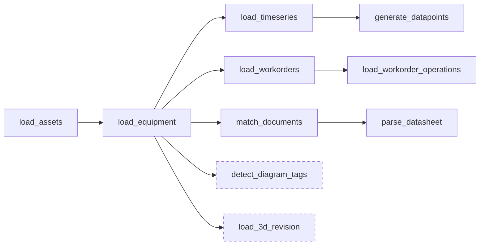

# Chapter 12 — Workflows

**Goal:** stop clicking "run" on seven resources one at a time. Wire your four
transformations and three functions into a single orchestrated DAG with correct
dependencies, retries, and failure handling.

📚 `[DOCS]` https://docs.cognite.com/cdf/data_workflows/overview ·
https://docs.cognite.com/cdf/data_workflows/task_types ·
https://docs.cognite.com/cdf/data_workflows/workflow_user_guide ·
https://docs.cognite.com/cdf/data_workflows/limits_and_restrictions_workflows

---

## 12.1 [INFO] Why a Workflow, not "run everything manually every time"

You've been calling each transformation and Function individually — correct while
learning each one in isolation, wrong as a repeatable operational pattern. A
**Workflow** encodes *order* (equipment must load before work orders reference it),
*parallelism* (independent branches run concurrently instead of serially), *retries*,
and *failure policy* (should one failing branch abort everything, or should the rest
continue?) as a single deployable, re-runnable resource.

---

## 12.2 [INFO] The task graph — ten tasks, and one risk to bound



Dashed tasks carry `onFailure: skipTask` — the workflow finishes without them. Everything
else is `abortWorkflow`.

Ten tasks: five transformations and five Functions, orchestrated uniformly.

ℹ️ `[INFO]` **Two of them are allowed to fail.** `detect_diagram_tags` and
`load_3d_revision` both call services that can be slow or temporarily unhealthy —
diagram-detect jobs have been seen stuck at `Distributed` with no cancel API, and 3D
conversion is genuinely long-running. Both therefore carry `onFailure: skipTask`
rather than the default `abortWorkflow`.

That is the pattern worth taking away: **you do not keep a flaky dependency out of your
pipeline, you bound what its failure can cost.** A task with `skipTask` plus a real
`timeout` cannot take the rest of the run down with it. Leaving it out entirely means
somebody has to remember to run it by hand, forever — and they will forget.

⚠️ `[COMMON MISTAKE]` Giving every task `onFailure: abortWorkflow` because it sounds
safest. It is the right default for a *load* step — half-loaded data downstream is
worse than no data — but applied to an enrichment step it turns one flaky external
service into a pipeline that never completes.

Two dependency shapes worth naming:

- **Serial dependency** (`load_equipment` depends on `load_assets`): equipment's
  `asset` relation needs the asset node to exist first.
- **Fan-out** (four branches all depend only on `load_equipment`, not on each other):
  `load_timeseries`, `load_workorders`, `match_documents`, and `load_3d_revision` have
  no relationship to each other — they run **in parallel**, which is faster than an
  arbitrary serial chain and also *correctly expresses* that they're independent.

---

## 12.3 [WRITE] The Workflow and its version

📝 `[WRITE]` `training/modules/participants/<YOURNAME>/workflows/wkf_<YOURNAME>_Training_TRN.Workflow.yaml`

```yaml
externalId: wkf_<YOURNAME>_Training_TRN
description: End-to-end contextualization pipeline for <YOURNAME>.
dataSetExternalId: dts_<YOURNAME>_Training_TRN
```

📝 `[WRITE]` `training/modules/participants/<YOURNAME>/workflows/wkf_<YOURNAME>_Training_TRN.v1.WorkflowVersion.yaml`

```yaml
workflowExternalId: wkf_<YOURNAME>_Training_TRN
version: v1
workflowDefinition:
  description: Load, contextualize and enrich <YOURNAME>'s TRN data model.
  tasks:
    - externalId: load_assets
      type: transformation
      name: 1. Load asset hierarchy
      parameters:
        transformation:
          externalId: tra_<YOURNAME>_Training_TRN_Load_Assets
          concurrencyPolicy: fail
      retries: 1
      timeout: 1800
      onFailure: abortWorkflow
      dependsOn: []

    - externalId: load_equipment
      type: transformation
      name: 2. Load equipment
      parameters:
        transformation:
          externalId: tra_<YOURNAME>_Training_TRN_Load_Equipment
          concurrencyPolicy: fail
      retries: 1
      timeout: 1800
      onFailure: abortWorkflow
      dependsOn:
        - externalId: load_assets

    - externalId: load_timeseries
      type: transformation
      name: 3. Load timeseries
      parameters:
        transformation:
          externalId: tra_<YOURNAME>_Training_TRN_Load_TimeSeries
          concurrencyPolicy: fail
      retries: 1
      timeout: 1800
      onFailure: abortWorkflow
      dependsOn:
        - externalId: load_equipment

    - externalId: load_workorders
      type: transformation
      name: 4. Load work orders
      parameters:
        transformation:
          externalId: tra_<YOURNAME>_Training_TRN_Load_WorkOrders
          concurrencyPolicy: fail
      retries: 1
      timeout: 1800
      onFailure: abortWorkflow
      dependsOn:
        - externalId: load_equipment

    - externalId: load_workorder_operations
      type: transformation
      name: 5. Load work-order operations
      parameters:
        transformation:
          externalId: tra_<YOURNAME>_Training_TRN_Load_WorkOrderOperations
          concurrencyPolicy: fail
      retries: 1
      timeout: 1800
      onFailure: abortWorkflow
      dependsOn:
        - externalId: load_workorders

    - externalId: generate_datapoints
      type: function
      name: 5. Generate datapoints
      parameters:
        function:
          externalId: fnc_<YOURNAME>_Training_GenerateDatapoints
          data: {}
        isAsyncComplete: false
      retries: 1
      timeout: 1800
      onFailure: abortWorkflow
      dependsOn:
        - externalId: load_timeseries

    # Call it manually, once. Do not wire it into a re-runnable workflow.

    - externalId: match_documents
      type: function
      name: 6. Match documents to assets
      parameters:
        function:
          externalId: fnc_<YOURNAME>_Training_MatchDocuments
          data: {}
        isAsyncComplete: false
      retries: 1
      timeout: 1800
      onFailure: abortWorkflow
      dependsOn:
        - externalId: load_equipment

    - externalId: detect_diagram_tags
      type: function
      name: 8. Detect tags on the P&ID
      parameters:
        function:
          externalId: fnc_<YOURNAME>_Training_DetectDiagramTags
          data: {}
        isAsyncComplete: false
      retries: 1
      timeout: 1800
      onFailure: skipTask          # a flaky service must not abort the run
      dependsOn:
        - externalId: load_equipment

    - externalId: parse_datasheet
      type: function
      name: 7. Parse datasheet
      parameters:
        function:
          externalId: fnc_<YOURNAME>_Training_ParseDatasheet
          data: {}
        isAsyncComplete: false
      retries: 1
      timeout: 1800
      onFailure: abortWorkflow
      dependsOn:
        - externalId: match_documents
        - externalId: load_workorders

    - externalId: load_3d_revision
      type: function
      name: 8. Upload 3D revision and map to assets
      parameters:
        function:
          externalId: fnc_<YOURNAME>_Training_Load3DRevision
          data: {}
        isAsyncComplete: false
      retries: 0
      timeout: 3600
      onFailure: skipTask
      dependsOn:
        - externalId: load_equipment
```

**Reading the fields that matter:**

| Field | Meaning |
|---|---|
| `type: transformation` vs `type: function` | Which kind of resource this task invokes — the Toolkit task graph orchestrates both uniformly |
| `concurrencyPolicy: fail` | If this transformation is already running (e.g. from a previous, still-in-flight workflow execution), fail fast rather than starting a second overlapping run |
| `isAsyncComplete: false` | The workflow waits for the Function call to actually finish before marking the task done — not just for it to be *accepted* |
| `retries` | How many times to retry *this task* on failure before the workflow's own `onFailure` policy kicks in |
| `timeout` | Seconds before the task itself is killed — note `load_3d_revision` gets 3600s (an hour) vs. 1800s (30 min) for everything else, because 3D conversion is genuinely slower |
| `onFailure: abortWorkflow` | Default here — a genuinely broken load shouldn't let downstream tasks run against half-loaded data |
| `onFailure: skipTask` (only on `load_3d_revision`) | The one deliberate exception — per Chapter 09 §9.2, 3D conversion queueing is not a pipeline failure; the rest of the DAG should complete regardless |
| `dependsOn` | The DAG edges — an empty list means "no prerequisite, can start immediately" |

⚠️ `[COMMON MISTAKE]` Setting `retries` high "to be safe" on a task with
`concurrencyPolicy: fail`. If the underlying cause of failure is a genuinely bad
transformation (bad SQL, missing RAW row), retrying just re-fails at the same cost,
`retries` times, before you see the real error. `retries: 1` here is deliberate — one
retry absorbs a transient blip, not a real bug.

---

## 12.4 [ACTION] Build, deploy, run

```bash
uv run cdf build --config-yaml training/config.<YOURNAME>-training.yaml
uv run cdf deploy --cdf-project <your-cdf-project> --include workflows
```

🟢 `[ACTION]` Trigger an execution:

```python
import os
from cognite.client import CogniteClient
from cognite.client.config import ClientConfig
from cognite.client.credentials import OAuthClientCredentials, OAuthInteractive

def cdf_client(client_name: str = "dm-handson") -> CogniteClient:
    """Same helper as Chapter 07 §7.3. CogniteClient() with no arguments does NOT
    read .env -- the SDK dropped implicit construction in v8."""
    base   = os.environ.get("CDF_URL") or f"https://{os.environ['CDF_CLUSTER']}.cognitedata.com"
    scopes = [s for s in os.environ.get("IDP_SCOPES", f"{base}/.default").split(",") if s]
    if os.environ.get("LOGIN_FLOW", "interactive").lower() == "interactive":
        creds = OAuthInteractive(authority_url=os.environ["IDP_AUTHORITY_URL"],
                                 client_id=os.environ["IDP_CLIENT_ID"], scopes=scopes)
    else:
        creds = OAuthClientCredentials(token_url=os.environ["IDP_TOKEN_URL"],
                                       client_id=os.environ["IDP_CLIENT_ID"],
                                       client_secret=os.environ["IDP_CLIENT_SECRET"],
                                       scopes=scopes)
    return CogniteClient(ClientConfig(client_name=client_name,
                                      project=os.environ["CDF_PROJECT"],
                                      base_url=base, credentials=creds))

client = cdf_client()   # see Chapter 07 §7.3

execution = client.workflows.executions.run(workflow_external_id="wkf_<YOURNAME>_Training_TRN", version="v1")
print(execution.id, execution.status)
```

🟢 `[ACTION]` Watch it (Fusion → Workflows → your workflow → the execution graph
renders live), or poll:

```python
import time
while True:
    detail = client.workflows.executions.retrieve_detailed(execution.id)
    print(detail.status)
    if detail.status in ("completed", "failed", "terminated"):
        break
    time.sleep(10)
```

✅ `[VERIFY]` All ten tasks show `completed` in about 80 seconds. `load_3d_revision` or
`detect_diagram_tags` may instead show
`skipped` if 3D was still converting — that's a **pass**, not a failure, per §12.2.

🚧 `[LIMITS]` Workflow executions and per-task timeouts are project-scoped resources
with their own quotas — see the limits page linked at the top of this chapter before
you design a workflow with dozens of tasks or very long timeouts.

---

## Gate

**Do not proceed to Chapter 17 until:**

- Your workflow deploys and a full execution completes with only `load_3d_revision`
  possibly skipped
- You can explain why `detect_diagram_tags` and `load_3d_revision` use `skipTask`
- You can name one serial dependency and one fan-out in your own graph, and why each
  is shaped that way
- 📓 You have added your two or three lines for this chapter to `participants/<YOURNAME>/NOTES.md` — **now**, not tonight

→ [Chapter 13 — Querying the graph](13-querying-the-graph.md)
