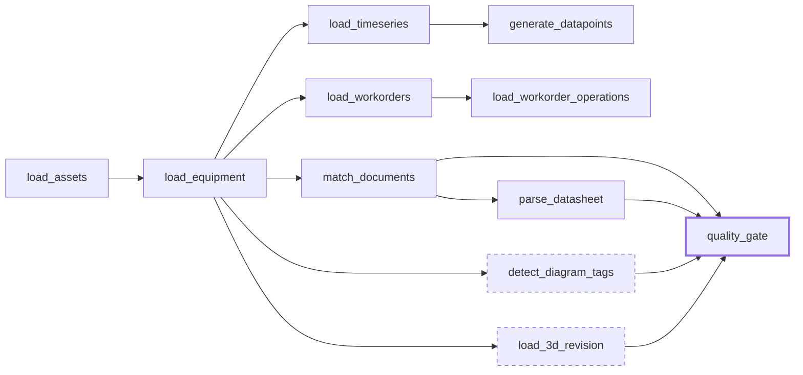

# Chapter 12 — Workflows

**Goal:** stop clicking "run" on seven resources one at a time. Wire your four
transformations and three functions into a single orchestrated DAG with correct
dependencies, retries, and failure handling.

📚 `[DOCS]` https://docs.cognite.com/cdf/data_workflows/overview ·
https://docs.cognite.com/cdf/data_workflows/task_types ·
https://docs.cognite.com/cdf/data_workflows/workflow_user_guide ·
https://docs.cognite.com/cdf/data_workflows/limits_and_restrictions_workflows

---

## 12.1 [INFO] Why a Workflow, not "run everything manually every time"

You've been calling each transformation and Function individually — correct while
learning each one in isolation, wrong as a repeatable operational pattern. A
**Workflow** encodes *order* (equipment must load before work orders reference it),
*parallelism* (independent branches run concurrently instead of serially), *retries*,
and *failure policy* (should one failing branch abort everything, or should the rest
continue?) as a single deployable, re-runnable resource.

---

## 12.2 [INFO] The task graph — eleven tasks, and one risk to bound



Dashed tasks carry `onFailure: skipTask` — the workflow finishes without them. Everything
else is `abortWorkflow`.

Eleven tasks: five transformations, five Functions that do work, and one that asserts
the work was good — orchestrated uniformly.

ℹ️ `[INFO]` **Two of them are allowed to fail**, for two different reasons, and the
difference is worth understanding before you copy the setting.

`detect_diagram_tags` calls a service that can be slow or temporarily unhealthy —
diagram-detect jobs have been seen stuck at `Distributed` with no cancel API. That is a
**flaky dependency**: it usually works, and you bound what its failure costs.

`load_3d_revision` is different. It fails **every time it runs here**, and predictably:

```
Sessions chaining depth limit exceeded | code: 400
```

The Function mints its own session for the 3D conversion nonce
([Chapter 09](09-3d.md)). Called directly that is three sessions deep; called from a
Workflow it is four, and four is past the limit. The identical Function, on the identical
data, **succeeds when you call it yourself and fails inside this workflow**.

That is not a flaky dependency, it is a structural constraint, and `skipTask` is a
deliberate *acceptance* of it rather than a hedge against bad luck. Know which of the two
you are doing every time you write that line. The honest way to record it is in the
comment next to the setting — a `skipTask` with no note reads, to the next person, as
"nobody was sure".

That is the pattern worth taking away: **you do not keep a flaky dependency out of your
pipeline, you bound what its failure can cost.** A task with `skipTask` plus a real
`timeout` cannot take the rest of the run down with it. Leaving it out entirely means
somebody has to remember to run it by hand, forever — and they will forget.

⚠️ `[COMMON MISTAKE]` Giving every task `onFailure: abortWorkflow` because it sounds
safest. It is the right default for a *load* step — half-loaded data downstream is
worse than no data — but applied to an enrichment step it turns one flaky external
service into a pipeline that never completes.

Two dependency shapes worth naming:

- **Serial dependency** (`load_equipment` depends on `load_assets`): equipment's
  `asset` relation needs the asset node to exist first.
- **Fan-out** (four branches all depend only on `load_equipment`, not on each other):
  `load_timeseries`, `load_workorders`, `match_documents`, and `load_3d_revision` have
  no relationship to each other — they run **in parallel**, which is faster than an
  arbitrary serial chain and also *correctly expresses* that they're independent.
- **Fan-in** (`quality_gate` depends on all four enrichment tasks): the gate cannot run
  until everything that writes provenance has finished, because it asserts what they
  wrote.

### The eleventh task — the one that can say no

The other ten tasks all *do* something. `quality_gate` only checks, and it is the only
task in this workflow whose job is to **fail**.

It reads the `ContextualizationRun` record the pipeline just wrote ([Chapter 17](17-cross-cutting-mastery.md)
section 17.1c) and asserts the numbers: nothing errored, the run actually completed, and
the unresolved / review / stale counts are inside their budgets. The budgets live in
`envVars`, not in the code, so tightening one is a config change somebody reviews rather
than a code change somebody redeploys a Function for.

Three details in its task definition are the whole lesson:

| Setting | Value | Why |
|---|---|---|
| `retries` | `0` | A gate that retries is not a gate, it is a hope. The data will not be different in thirty seconds. |
| `onFailure` | `abortWorkflow` | A gate that lets the run finish green is decoration. |
| `dependsOn` | all four enrichment tasks | Assert *after* everything that writes has written, or you gate a half-finished run. |

⚠️ `[COMMON MISTAKE]` Writing the gate to `return {"passed": False}` instead of raising.
The Function succeeds, the task goes **green**, the workflow completes, and the only
record that anything was wrong is a JSON blob nobody opens. A Workflow task fails if and
only if the Function raises.

💡 `[GOOD TO KNOW]` Notice what the gate does *not* do: it never re-derives the counts by
re-querying the graph. It asserts the numbers the run recorded about itself. Re-deriving
them gives you a second source of truth that disagrees with the first the moment anyone
edits either — and then you are debugging your monitoring instead of your pipeline.

---

## 12.2b [WRITE] The quality gate Function

Write this before the workflow, because the workflow references it by external ID and a
Workflow version whose task names a Function that does not exist deploys happily and then
fails at run time.

📝 `[WRITE]` `training/modules/participants/<YOURNAME>/functions/fnc_<YOURNAME>_Training_QualityGate/handler.py`

```python
"""The quality gate: assert the last contextualization run, and fail if it is bad.

A count is not a gate until something goes red on it. Every number written by
`_write_spine` in MatchDocuments is checked here, and the distinction that matters is
between two kinds of failure:

* `failedCount` and a `status` that is not `completed` are **bugs** -- code that threw,
  or a job that died. They are never acceptable at any threshold.
* `unresolvedCount`, `reviewCount` and `staleRemovedCount` are **data quality**. They
  have budgets, the budgets live in envVars, and exceeding one is a business decision
  to make, not a crash to debug.

Conflating those two is how a crashing pipeline gets explained away as "the data is
messy this week" for six months.

Returns a report and raises on failure, because a Workflow task only goes red if the
Function does. Returning `{"passed": false}` produces a green workflow with a sad
message in it, which nobody will ever see.
"""

import os
import time

from cognite.client.data_classes.data_modeling import ViewId

# Data modeling reads lag writes. Measured on bluefield, an instance became visible to
# instances.list() between 0.8 s and 2.4 s after apply() returned. A gate that runs as
# the next Workflow task after the job it is gating therefore races it: it reads the
# PREVIOUS run's record, passes on yesterday's healthy numbers, and reports green for a
# run it never saw. Poll instead of assuming.
SETTLE_TIMEOUT = 30.0
SETTLE_INTERVAL = 1.0


class QualityGateFailed(AssertionError):
    """Raised when a run breaches a threshold. The Workflow task fails with this."""


def _int(name: str, default: int) -> int:
    try:
        return int(os.environ.get(name, default))
    except (TypeError, ValueError):
        return default


def handle(client, data=None, secrets=None, function_call_info=None) -> dict:
    space = os.environ["INSTANCE_SPACE"]
    sdm = os.environ["SCHEMA_SPACE_SDM"]
    version = os.environ.get("MODEL_VERSION", "v1.0.0")
    data = data or {}

    run_view = ViewId(sdm, "ContextualizationRun", version)

    # A caller can pin the gate to one run; a Workflow passes the ID its own upstream
    # task produced, so the gate cannot accidentally pass on last night's healthy run.
    wanted = data.get("runId")
    # `after` lets an unpinned caller say "only consider runs newer than this", which is
    # the weaker guard you fall back on when the upstream task cannot return an ID.
    after = data.get("startedAfter")

    deadline = time.time() + SETTLE_TIMEOUT
    run = None
    while True:
        runs = client.data_modeling.instances.list(
            sources=run_view, space=space, limit=-1)
        candidates = runs
        if wanted:
            candidates = [n for n in runs
                          if n.properties[run_view].get("runId") == wanted]
        elif after:
            candidates = [n for n in runs
                          if (n.properties[run_view].get("startedTime") or "") > after]
        if candidates:
            run = max(candidates,
                      key=lambda n: n.properties[run_view].get("startedTime") or "")
            break
        if time.time() >= deadline:
            break
        time.sleep(SETTLE_INTERVAL)

    if run is None:
        if wanted:
            raise QualityGateFailed(
                f"run {wanted!r} was never recorded, and did not appear within "
                f"{SETTLE_TIMEOUT:.0f}s. Either the upstream task did not write its run, "
                "or it failed before it got that far.")
        if after:
            raise QualityGateFailed(
                f"no ContextualizationRun started after {after!r} appeared within "
                f"{SETTLE_TIMEOUT:.0f}s -- the run being gated never wrote a record.")
        raise QualityGateFailed(
            "no ContextualizationRun records exist -- either contextualization never "
            "ran, or it ran and wrote no provenance at all. Both are failures.")

    p = dict(run.properties[run_view])
    failures: list[str] = []

    # ---- bugs: never acceptable ---------------------------------------------------
    if p.get("status") != "completed":
        failures.append(
            f"status is {p.get('status')!r}, not 'completed' -- the run never finished. "
            "A run still marked 'running' is a Function that died without saying so.")
    if (p.get("failedCount") or 0) > 0:
        failures.append(
            f"failedCount={p.get('failedCount')} -- items errored. This is a bug in the "
            "pipeline, not a data quality problem, and no threshold makes it acceptable.")

    # ---- data quality: budgeted ---------------------------------------------------
    budgets = [
        ("unresolvedCount", _int("MAX_UNRESOLVED", 0),
         "documents no rung could resolve"),
        ("reviewCount", _int("MAX_REVIEW_BACKLOG", 10),
         "suggestions waiting on a human -- the backlog is growing faster than it is worked"),
        ("staleRemovedCount", _int("MAX_STALE_REMOVED", 5),
         "links a previous run made and this one no longer produces -- somebody changed "
         "a rule, or a source system renamed things"),
    ]
    for field, budget, why in budgets:
        actual = p.get(field) or 0
        if actual > budget:
            failures.append(f"{field}={actual} exceeds the budget of {budget}: {why}")

    report = {
        "runId": p.get("runId"),
        "technique": p.get("technique"),
        "rulesVersion": p.get("rulesVersion"),
        "checked": {f: p.get(f) or 0 for f, _, _ in budgets},
        "budgets": {f: b for f, b, _ in budgets},
        "status": p.get("status"),
        "failedCount": p.get("failedCount") or 0,
        "passed": not failures,
    }
    if failures:
        report["failures"] = failures
        raise QualityGateFailed(
            f"quality gate failed for run {p.get('runId')}:\n  - "
            + "\n  - ".join(failures))
    return report
```

📝 `[WRITE]` `training/modules/participants/<YOURNAME>/functions/fnc_<YOURNAME>_Training_QualityGate/requirements.txt`

```
cognite-sdk==8.10.0
```

📝 `[WRITE]` `training/modules/participants/<YOURNAME>/functions/QualityGate.Function.yaml`

```yaml
externalId: fnc_<YOURNAME>_Training_QualityGate
name: fnc_<YOURNAME>_Training_QualityGate
owner: Training
description: >-
  Assert the contextualization thresholds and fail loudly when they are not met.
  A count nobody fails on is a number on a dashboard, not a gate.
functionPath: handler.py
runtime: py311
dataSetExternalId: dts_<YOURNAME>_Training_TRN
envVars:
  PARTICIPANT: "<YOURNAME>"
  INSTANCE_SPACE: "isp_<YOURNAME>_TRN"
  SCHEMA_SPACE_SDM: "ssp_<YOURNAME>_MaintenanceInsight_sdm"
  MODEL_VERSION: "v1.0.0"
  # The thresholds live here, not in the code, so tightening one is a config change
  # somebody can review -- not a code change somebody has to redeploy a Function for.
  MAX_UNRESOLVED: "0"
  MAX_REVIEW_BACKLOG: "10"
  MAX_STALE_REMOVED: "5"
```

🔧 `[CHANGE]` `<YOURNAME>` throughout, and the three space names.

🟢 `[ACTION]` Deploy it now and wait — a Function's first build is the long pole in this
whole course ([Chapter 07](07-entity-matching.md)):

```bash
uv run cdf build  --config-yaml training/config.<YOURNAME>-training.yaml
uv run cdf deploy --cdf-project <your-cdf-project> --include functions
```

✅ `[VERIFY]` Call it by hand before you wire it into anything. A gate you have never seen
fail is a gate you have not tested:

```python
fn = client.functions.retrieve(external_id="fnc_<YOURNAME>_Training_QualityGate")
call = fn.call()
call.wait()
print(call.status)                 # Completed
print(call.get_response())         # passed: True, with the counts and the budgets
```

✅ `[VERIFY]` Now make it fail on purpose, which is the only way to know it works. Set
`MAX_UNRESOLVED` to `-1` in `QualityGate.Function.yaml`, redeploy, and call it again:
`call.status` is `Failed`, and `call.get_logs()` carries the `QualityGateFailed` message
naming the budget it breached. Put the value back to `0` afterwards.

⚠️ `[COMMON MISTAKE]` Skipping that second check because the first one passed. A gate that
has only ever been observed passing is indistinguishable from a gate that cannot fail —
and the two behave identically right up to the day you need one of them.

---

## 12.3 [WRITE] The Workflow and its version

📝 `[WRITE]` `training/modules/participants/<YOURNAME>/workflows/wkf_<YOURNAME>_Training_TRN.Workflow.yaml`

```yaml
externalId: wkf_<YOURNAME>_Training_TRN
description: End-to-end contextualization pipeline for <YOURNAME>.
dataSetExternalId: dts_<YOURNAME>_Training_TRN
```

📝 `[WRITE]` `training/modules/participants/<YOURNAME>/workflows/wkf_<YOURNAME>_Training_TRN.v1.WorkflowVersion.yaml`

```yaml
workflowExternalId: wkf_<YOURNAME>_Training_TRN
version: v1
workflowDefinition:
  description: Load, contextualize and enrich <YOURNAME>'s TRN data model.
  tasks:
    - externalId: load_assets
      type: transformation
      name: 1. Load asset hierarchy
      parameters:
        transformation:
          externalId: tra_<YOURNAME>_Training_TRN_Load_Assets
          concurrencyPolicy: fail
      retries: 1
      timeout: 1800
      onFailure: abortWorkflow
      dependsOn: []

    - externalId: load_equipment
      type: transformation
      name: 2. Load equipment
      parameters:
        transformation:
          externalId: tra_<YOURNAME>_Training_TRN_Load_Equipment
          concurrencyPolicy: fail
      retries: 1
      timeout: 1800
      onFailure: abortWorkflow
      dependsOn:
        - externalId: load_assets

    - externalId: load_timeseries
      type: transformation
      name: 3. Load timeseries
      parameters:
        transformation:
          externalId: tra_<YOURNAME>_Training_TRN_Load_TimeSeries
          concurrencyPolicy: fail
      retries: 1
      timeout: 1800
      onFailure: abortWorkflow
      dependsOn:
        - externalId: load_equipment

    - externalId: load_workorders
      type: transformation
      name: 4. Load work orders
      parameters:
        transformation:
          externalId: tra_<YOURNAME>_Training_TRN_Load_WorkOrders
          concurrencyPolicy: fail
      retries: 1
      timeout: 1800
      onFailure: abortWorkflow
      dependsOn:
        - externalId: load_equipment

    - externalId: load_workorder_operations
      type: transformation
      name: 5. Load work-order operations
      parameters:
        transformation:
          externalId: tra_<YOURNAME>_Training_TRN_Load_WorkOrderOperations
          concurrencyPolicy: fail
      retries: 1
      timeout: 1800
      onFailure: abortWorkflow
      dependsOn:
        - externalId: load_workorders

    - externalId: generate_datapoints
      type: function
      name: 6. Generate datapoints
      parameters:
        function:
          externalId: fnc_<YOURNAME>_Training_GenerateDatapoints
          data: {}
        isAsyncComplete: false
      retries: 1
      timeout: 1800
      onFailure: abortWorkflow
      dependsOn:
        - externalId: load_timeseries


    - externalId: match_documents
      type: function
      name: 7. Match documents to assets
      parameters:
        function:
          externalId: fnc_<YOURNAME>_Training_MatchDocuments
          data: {}
        isAsyncComplete: false
      retries: 1
      timeout: 1800
      onFailure: abortWorkflow
      dependsOn:
        - externalId: load_equipment

    - externalId: detect_diagram_tags
      type: function
      name: 8. Detect tags on the P&ID
      parameters:
        function:
          externalId: fnc_<YOURNAME>_Training_DetectDiagramTags
          data: {}
        isAsyncComplete: false
      retries: 1
      timeout: 1800
      onFailure: skipTask
      dependsOn:
        - externalId: load_equipment

    - externalId: parse_datasheet
      type: function
      name: 9. Parse datasheet
      parameters:
        function:
          externalId: fnc_<YOURNAME>_Training_ParseDatasheet
          data: {}
        isAsyncComplete: false
      retries: 1
      timeout: 1800
      onFailure: abortWorkflow
      dependsOn:
        - externalId: match_documents
        - externalId: load_workorders

    - externalId: load_3d_revision
      type: function
      name: 10. Upload 3D revision and map to assets
      parameters:
        function:
          externalId: fnc_<YOURNAME>_Training_Load3DRevision
          data: {}
        isAsyncComplete: false
      retries: 0
      timeout: 3600
      onFailure: skipTask
      dependsOn:
        - externalId: load_equipment

    # The gate runs last and depends on everything that writes provenance. Note
    # `onFailure: abortWorkflow` and `retries: 0` -- a gate that retries is not a gate,
    # it is a hope, and a gate that lets the workflow finish green is decoration.
    - externalId: quality_gate
      type: function
      name: 11. Quality gate
      parameters:
        function:
          externalId: fnc_<YOURNAME>_Training_QualityGate
          # Pin the gate to the run match_documents just produced. Without this the
          # gate asks for "the latest run" and, because data modeling reads lag writes
          # by a second or two (Chapter 17 section 17.1d), can satisfy itself with the
          # PREVIOUS run -- passing on last night's healthy numbers.
          data:
            runId: ${match_documents.output.response.run_id}
        isAsyncComplete: false
      retries: 0
      timeout: 900
      onFailure: abortWorkflow
      dependsOn:
        - externalId: match_documents
        - externalId: detect_diagram_tags
        - externalId: parse_datasheet
        - externalId: load_3d_revision
```

**Reading the fields that matter:**

| Field | Meaning |
|---|---|
| `type: transformation` vs `type: function` | Which kind of resource this task invokes — the Toolkit task graph orchestrates both uniformly |
| `concurrencyPolicy: fail` | If this transformation is already running (e.g. from a previous, still-in-flight workflow execution), fail fast rather than starting a second overlapping run |
| `isAsyncComplete: false` | The workflow waits for the Function call to actually finish before marking the task done — not just for it to be *accepted* |
| `retries` | How many times to retry *this task* on failure before the workflow's own `onFailure` policy kicks in |
| `timeout` | Seconds before the task itself is killed — note `load_3d_revision` gets 3600s (an hour) vs. 1800s (30 min) for everything else, because 3D conversion is genuinely slower |
| `onFailure: abortWorkflow` | Default here — a genuinely broken load shouldn't let downstream tasks run against half-loaded data |
| `onFailure: skipTask` (only on `load_3d_revision`) | The one deliberate exception — per Chapter 09 section 9.2, 3D conversion queueing is not a pipeline failure; the rest of the DAG should complete regardless |
| `dependsOn` | The DAG edges — an empty list means "no prerequisite, can start immediately" |

⚠️ `[COMMON MISTAKE]` Setting `retries` high "to be safe" on a task with
`concurrencyPolicy: fail`. If the underlying cause of failure is a genuinely bad
transformation (bad SQL, missing RAW row), retrying just re-fails at the same cost,
`retries` times, before you see the real error. `retries: 1` here is deliberate — one
retry absorbs a transient blip, not a real bug.

---

## 12.4 [ACTION] Build, deploy, run

```bash
uv run cdf build --config-yaml training/config.<YOURNAME>-training.yaml
uv run cdf deploy --cdf-project <your-cdf-project> --include workflows
```

🟢 `[ACTION]` Trigger an execution:

```python
import os
from cognite.client import CogniteClient
from cognite.client.config import ClientConfig
from cognite.client.credentials import OAuthClientCredentials, OAuthInteractive

def cdf_client(client_name: str = "dm-handson") -> CogniteClient:
    """Same helper as Chapter 07 section 7.3. CogniteClient() with no arguments does NOT
    read .env -- the SDK dropped implicit construction in v8."""
    base   = os.environ.get("CDF_URL") or f"https://{os.environ['CDF_CLUSTER']}.cognitedata.com"
    scopes = [s for s in os.environ.get("IDP_SCOPES", f"{base}/.default").split(",") if s]
    if os.environ.get("LOGIN_FLOW", "interactive").lower() == "interactive":
        creds = OAuthInteractive(authority_url=os.environ["IDP_AUTHORITY_URL"],
                                 client_id=os.environ["IDP_CLIENT_ID"], scopes=scopes)
    else:
        creds = OAuthClientCredentials(token_url=os.environ["IDP_TOKEN_URL"],
                                       client_id=os.environ["IDP_CLIENT_ID"],
                                       client_secret=os.environ["IDP_CLIENT_SECRET"],
                                       scopes=scopes)
    return CogniteClient(ClientConfig(client_name=client_name,
                                      project=os.environ["CDF_PROJECT"],
                                      base_url=base, credentials=creds))

client = cdf_client()   # see Chapter 07 section 7.3

execution = client.workflows.executions.run(workflow_external_id="wkf_<YOURNAME>_Training_TRN", version="v1")
print(execution.id, execution.status)
```

🟢 `[ACTION]` Watch it (Fusion → Workflows → your workflow → the execution graph
renders live), or poll:

```python
import time
while True:
    detail = client.workflows.executions.retrieve_detailed(execution.id)
    print(detail.status)
    if detail.status in ("completed", "failed", "terminated"):
        break
    time.sleep(10)
```

✅ `[VERIFY]` All eleven tasks show `completed` in about 80 seconds. `load_3d_revision` or
`detect_diagram_tags` may instead show
`skipped` if 3D was still converting — that's a **pass**, not a failure, per section 12.2.

🚧 `[LIMITS]` Workflow executions and per-task timeouts are project-scoped resources
with their own quotas — see the limits page linked at the top of this chapter before
you design a workflow with dozens of tasks or very long timeouts.

---

## Gate

**Do not proceed to Chapter 17 until:**

- Your workflow deploys and a full execution completes with only `load_3d_revision`
  possibly skipped
- You can explain why `detect_diagram_tags` and `load_3d_revision` use `skipTask`
- You can name one serial dependency and one fan-out in your own graph, and why each
  is shaped that way
- 📓 You have added your two or three lines for this chapter to `participants/<YOURNAME>/NOTES.md` — **now**, not tonight

→ [Chapter 13 — Querying the graph](13-querying-the-graph.md)
