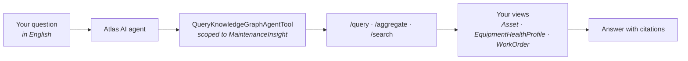

# Chapter 15 — Atlas AI: the agent your model was for

**Goal:** point an Atlas AI agent at the data model you built, ask it questions in English,
and understand *why* it can answer them — because every modeling decision from
[Chapter 03](03-data-modeling.md) is what makes the answer possible.

This is the payoff chapter. Everything before it was building the substrate.

---

## 15.1 [INFO] The model is the product

Three times this course has said you were building "the model an application or an Atlas AI
agent queries." Here is the uncomfortable truth behind that sentence:

**An agent cannot ask a question your model cannot answer.** It has no special access. It
issues the same `/query`, `/aggregate` and `/search` calls you wrote by hand in
[Chapter 13](13-querying-the-graph.md), against the same views, subject to the same
limits. When an agent gives a vague answer, the instinct is to rewrite the prompt. Nine
times out of ten the model is what needs rewriting.

Which means the work you have already done *is* the agent:

| What you did | What it buys the agent |
|---|---|
| PascalCase views, camelCase properties (§3.5) | It can guess property names correctly on the first try |
| `name` and `description` on **every** property (§3.7) | This is the agent's documentation. It reads these to decide what to query |
| `source:` on every direct relation (§3.12) | It can *navigate* `EquipmentHealthProfile → asset` instead of seeing an opaque ID |
| The `healthProfile` reverse direct relation (§3.9) | It can go from a pump to its profile — a direction that does not exist without the declaration |
| The `diagramAnnotations` edge connection (§3.9) | It can reach the P&ID that mentions a tag |
| `MaintenanceInsight` as a curated view list (§3.4) | It searches ten relevant views instead of sixty irrelevant ones |
| Units on the spec properties (§3.7) | It answers "250 kW", not "250" |

⚠️ `[COMMON MISTAKE]` Treating agent quality as a prompt-engineering problem. If the agent
says *"I found a property called `sealType` but I don't know what it means"*, the fix is a
`description` on that property, not a longer system prompt. **You improve the answer by
improving the model.**

---

## 15.2 [INFO] What an agent actually is here

Two objects, and the distinction matters:

- an **agent** — an external ID, instructions, and a list of tools
- its **tools** — the capabilities it may use. The one that matters for you is
  `QueryKnowledgeGraphAgentTool`, which is pointed at *specific data models and spaces*



ℹ️ `[INFO]` **Scoping is a correctness feature, not just a permission.** An agent pointed
at every model in the project has to guess which of sixty views means "pump". Pointed at
`MaintenanceInsight` and your instance space, the guess becomes trivial. Narrow scope is
the cheapest accuracy improvement available.

📚 `[DOCS]` https://docs.cognite.com/cdf/dm/dm_apps/dm_ai/

---

## 15.3 [WRITE] + [ACTION] Notebook: `09_atlas_ai_agent.ipynb`

📝 `[WRITE]` Create `docs/notebooks/09_atlas_ai_agent.ipynb`. Reuse the standard setup cell
from [notebook 07](notebooks/07_query_the_graph.ipynb) — same `cdf_client()`, same space
variables — then add the cells below.

🟢 `[ACTION]` Create the agent, scoped to exactly your model and your space:

```python
from cognite.client.data_classes.agents import (
    AgentUpsert, QueryKnowledgeGraphAgentToolUpsert,
    QueryKnowledgeGraphAgentToolConfiguration, DataModelInfo, InstanceSpaces, Message,
)

tool = QueryKnowledgeGraphAgentToolUpsert(
    name="maintenance_graph",
    description=(
        "The MaintenanceInsight model for one FPSO separation train: assets, equipment, "
        "work orders, equipment health profiles with datasheet specs, P&ID annotations "
        "and time series."
    ),
    configuration=QueryKnowledgeGraphAgentToolConfiguration(
        data_models=[DataModelInfo(
            space=SDM_SPACE, external_id="MaintenanceInsight", version=MODEL_VERSION,
            # Naming views narrows the search further. Omit to expose the whole model.
            view_external_ids=["Asset", "EquipmentHealthProfile", "WorkOrder"],
        )],
        # Scope to YOUR instances — not every node in the project.
        instance_spaces=InstanceSpaces(type="manual", spaces=[INSTANCE_SPACE]),
    ),
)

agent = client.agents.upsert(AgentUpsert(
    external_id=f"agt_{YOURNAME}_maintenance",
    name=f"{YOURNAME} Maintenance Insight",
    description="Answers reliability questions about the separation train.",
    instructions=(
        "You answer maintenance and reliability questions about one FPSO separation "
        "train. Always cite the externalIds of the instances you used. Units are "
        "declared on the properties -- state them. If the graph does not contain the "
        "answer, say so plainly instead of guessing."
    ),
    tools=[tool],
))
print(agent.external_id, "->", [t.name for t in agent.tools])
```

✅ `[VERIFY]` `client.agents.retrieve(f"agt_{YOURNAME}_maintenance")` returns the agent, and
it appears in Fusion under **Atlas AI → Agents**.

⚠️ `[COMMON MISTAKE]` Writing a thin tool `description`. That string is how the agent
decides *whether to use this tool at all*. "The maintenance graph" is not enough; say what
is in it, in the vocabulary a user would use.

---

## 15.4 [ACTION] Ask it the questions this course has been building toward

🟢 `[ACTION]` Start with a question you already know the answer to — you computed it by
hand in [Chapter 13](13-querying-the-graph.md) §13.5:

```python
def ask(question: str) -> str:
    response = client.agents.chat(
        agent_external_id=f"agt_{YOURNAME}_maintenance",
        messages=Message(content=question),
    )
    print(f"Q: {question}\n\nA: {response.text}\n")
    return response.text

ask("Which work orders are open against pump 21-PA-2001A, and what do they cost?")
```

✅ `[VERIFY]` The answer names **WO-1001**, `IN_PROGRESS`, **18500 EUR**. You verified those
exact values by hand in §13.5. If the agent disagrees with your own query, trust your query
and go find out why the agent saw something different.

🟢 `[ACTION]` Now the question that only works because of your schema decisions:

```python
ask("What is the rated power and seal type of pump 21-PA-2001A, "
    "and which document did that come from?")
```

✅ `[VERIFY]` It answers **250 kW**, a double mechanical seal (API Plan 53B), and cites the
datasheet PDF.

⚠️ `[COMMON MISTAKE]` Getting *"the graph contains no equipment health-profile record with
rated power"* and assuming the agent is broken. It is reporting the truth: your
`ehp_21-PA-2001A` node does not exist yet, or has no specs. The agent is downstream of
[Chapter 10](10-datasheet-parsing.md) — run `ParseDatasheet` first. Observed live: the
same question failed, then succeeded 30 seconds later once the profile was written.
Confirm before you blame the agent:

```python
from cognite.client.data_classes.data_modeling import ViewId
ehp = ViewId(SDM_SPACE, "EquipmentHealthProfile", MODEL_VERSION)
nodes = client.data_modeling.instances.list(sources=ehp, space=INSTANCE_SPACE, limit=-1)
print(len(nodes), nodes[0].properties[ehp].get("ratedPowerKw") if nodes else "no profile")
```

This is the chapter's whole thesis arriving early: **the answer was missing because the
data was missing, not because the question was badly worded.**

Stop and notice what had to be true for that to work:

1. The agent started at an **Asset** and needed its health profile. That is the
   `healthProfile` **reverse direct relation** you declared in §3.12 — without it, there is
   no path from pump to profile.
2. The specs live on `EquipmentHealthProfile`, and it knew what `ratedPowerKw` meant
   because of the `description` you wrote in §3.11.
3. It named the source document by following `datasheetFile`, which resolves only because
   that direct relation carries `source:` ([Chapter 10](10-datasheet-parsing.md)).

🟢 `[ACTION]` And the one that crosses three techniques at once:

```python
ask("Pump 21-PA-2001A: is anything wrong with it? "
    "Use its vibration trend, its open work orders and its design limits.")
```

✅ `[VERIFY]` A useful answer connects the rising vibration on `21-VT-2002`
([Chapter 11](11-datapoints.md)) with the in-progress seal replacement `WO-1001`
([Chapter 05](05-transformations.md)) and the nameplate specs
([Chapter 10](10-datasheet-parsing.md)). Three chapters, three ingestion techniques, one
English sentence.

---

## 15.5 [ACTION] Break it on purpose, then fix the model

This is the most valuable exercise in the chapter, because it teaches the debugging loop
you will actually use in production.

🟢 `[ACTION]` Ask something the graph cannot answer:

```python
ask("Who is the manufacturer's service representative for pump 21-PA-2001A?")
```

✅ `[VERIFY]` It should say it does not know. **An agent that invents a name here is worse
than useless** — and that is what your `instructions` string was for. If it hallucinates,
strengthen the instruction, then re-ask.

🟢 `[ACTION]` Now ask something the graph *does* contain but exposes badly:

```python
ask("Which assets appear on the P&ID drawing?")
```

⚠️ `[COMMON MISTAKE]` If this answer is weak, the reflex is to rephrase the question. Don't.
Check the model first, in this order:

1. Is `diagramAnnotations` declared on your `Asset` view? (§3.12) Without it the edges
   exist but nothing advertises them.
2. Does the `CogniteFile` node have a meaningful `name`? The agent surfaces what it can
   read.
3. Is `CogniteFile` inside the view list you scoped the tool to in §15.3?

⚡ `[OPTIMIZE]` The general loop: **bad answer → find the missing declaration, description
or link → fix the model → re-ask.** Only when the model is right does prompt wording start
to matter. You are not prompt-engineering; you are data-modeling with a faster feedback
loop than you have ever had.

---

## 15.6 [LIMITS] What to expect in production

🚧 `[LIMITS]`

- **The agent is non-deterministic.** Two identical questions can produce differently
  worded answers. Verify *facts and externalIds*, never exact wording — which is why every
  `[VERIFY]` above names an ID or a number.
- **It inherits your permissions.** It reads what the calling identity can read. It cannot
  reach a space you have no access to, and pointing it at data you shouldn't see is a
  governance problem, not a model problem.
- **Scope drives both cost and accuracy.** A tool pointed at every model in the project is
  slower, more expensive and less correct than one pointed at ten views.
- **This API is alpha, and the SDK says so out loud.** The first call prints:

  ```
  FeaturePreviewWarning: Agents is in alpha and is subject to breaking changes without
  prior notice. API maturity=beta, SDK maturity=alpha.
  ```

  That is not noise to suppress — it is the contract. Tool types, `runtime_version` and
  the response shape can change between releases. Pin your SDK version, and re-read the
  docs before you upgrade. Everything else in this course is stable API; this chapter is
  the exception, deliberately, because the capability is worth knowing now.
- **It does not fix bad data.** The phantom `21-XX-9999` node from
  [Chapter 14](14-debugging-broken-links.md) is still there, and an agent will happily
  report it as an asset. Contextualisation quality is upstream of agent quality.

---

## 15.7 [ACTION] Clean up

🟢 `[ACTION]` The agent is a global resource — it is not deleted by purging your spaces:

```python
client.agents.delete(f"agt_{YOURNAME}_maintenance", ignore_unknown_ids=True)
print([a.external_id for a in client.agents.list()
       if YOURNAME in (a.external_id or "")])     # expect []
```

✅ `[VERIFY]` The list is empty. [Chapter 18](18-teardown.md) does not know about your
agent — delete it here.

---

## Gate

**Do not proceed to Chapter 16 until:**

- Your agent exists, is scoped to `MaintenanceInsight` and your instance space, and answers
  the WO-1001 question with the same values you computed by hand in §13.5
- You have asked a question the graph cannot answer and seen it decline rather than invent
- You can name the **three** schema decisions that make the rated-power question
  answerable, and what would break if each were missing
- You can explain why "the agent gave a vague answer" is usually a modeling bug
- 📓 You have added your two or three lines for this chapter to
  `participants/<YOURNAME>/NOTES.md` — **now**, not tonight

→ [Chapter 16 — Cross-cutting mastery](16-cross-cutting-mastery.md)
