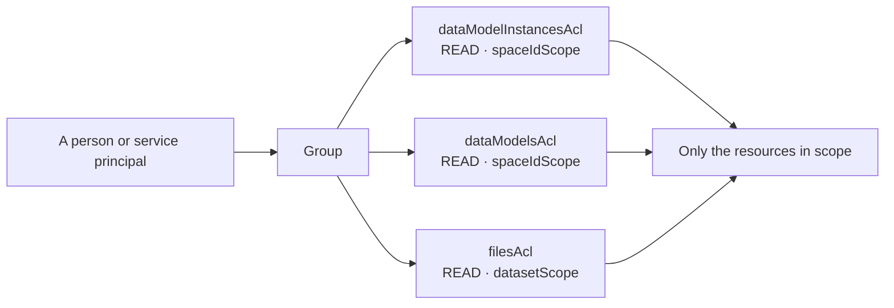

# Chapter 16 — Access management: groups, scopes and least privilege

**Goal:** stop thinking about permissions as "which ACL do I need to make this work" and
start designing them as "who should be able to see and change what."

[Chapter 02](02-auth-and-security.md) answered the first question — it is the chapter you
reach for when something 403s. This one answers the second, and it is the difference
between a lab and a deployment somebody will let you put in production.

---

## 16.1 [INFO] The three things a capability is made of

Every permission in CDF is the same shape, and once you see it the whole model collapses
into something small:

```
  <acl>  ×  <actions>  ×  <scope>
```

- **acl** — *what kind of thing*: `dataModelInstancesAcl`, `filesAcl`, `timeSeriesAcl`
- **actions** — *what you may do to it*: `READ`, `WRITE`, sometimes more
- **scope** — ***which ones***

Almost everybody gets the first two right and ignores the third. **Scope is the entire
game.** `dataModelInstancesAcl: READ` with `all` scope means *every instance in the
project*. The same ACL scoped to one space means what you actually intended.



ℹ️ `[INFO]` A **group** is just a named bundle of capabilities, bound to an identity
provider group by `sourceId`. Membership is managed in Entra ID, not in CDF. CDF decides
*what a group can do*; your IdP decides *who is in it*.

---

## 16.2 [INFO] The two scope types you will actually use

| Scope | Written as | Applies to |
|---|---|---|
| Everything | `all: {}` | any ACL — and almost always wrong outside a platform-admin group |
| A set of spaces | `spaceIdScope: {spaceIds: [...]}` | the data-modeling ACLs |
| A set of data sets | `datasetScope: {ids: [...]}` | the classic ACLs — files, time series, events |

⚠️ `[COMMON MISTAKE]` Assuming a **space** scope protects classic resources too. It does
not. Your two PDFs are `CogniteFile` **instances** (space-scoped) but the OBJ from
[Chapter 09](09-3d.md) is a **classic file** governed by a *data set*. A group scoped only
to your spaces can read one and not the other — and the error will say `403`, not "you
used the wrong scope type". That split is the single most confusing thing about CDF
permissions, and it is a direct consequence of the two-worlds story in
[Chapter 04](04-data-sets-raw-and-files.md) section 4.1.

💡 `[GOOD TO KNOW]` Scoping is not only about security. A `READ` scoped to three spaces is
**faster** than one scoped to everything, because the authorization filter is applied
before the query planner runs.

---

## 16.3 [WRITE] Three groups, not one

The instinct is to write one group per person. The pattern that survives is **one group
per role**, with people moved between them in the IdP.

📝 `[WRITE]` `training/modules/participants/<YOURNAME>/auth/reader.Group.yaml`

```yaml
name: gp_<YOURNAME>_training_reader
sourceId: <your-idp-group-object-id>
metadata:
  module_version: '1'
capabilities:
  # Read the model itself - the schema.
  - dataModelsAcl:
      actions: [READ]
      scope:
        spaceIdScope:
          spaceIds:
            - ssp_<YOURNAME>_TrainingCore_edm
            - ssp_<YOURNAME>_MaintenanceInsight_sdm
  # Read the data in it.
  - dataModelInstancesAcl:
      actions: [READ]
      scope:
        spaceIdScope:
          spaceIds:
            - isp_<YOURNAME>_TRN
  # Classic resources are data-set scoped, NOT space scoped. See Chapter 16 section 16.2.
  - filesAcl:
      actions: [READ]
      scope:
        datasetScope:
          ids:
            - dts_<YOURNAME>_Training_TRN
  - timeSeriesAcl:
      actions: [READ]
      scope:
        datasetScope:
          ids:
            - dts_<YOURNAME>_Training_TRN
```

🔧 `[CHANGE]` `<YOURNAME>` throughout, and `sourceId` to a real IdP group object ID. The
Toolkit will deploy a group with a placeholder `sourceId`, and it will simply never match
anybody.

📝 `[WRITE]` `training/modules/participants/<YOURNAME>/auth/developer.Group.yaml`

```yaml
name: gp_<YOURNAME>_training_developer
sourceId: <your-idp-group-object-id>
metadata:
  module_version: '1'
capabilities:
  # A developer may change the schema - inside their own spaces only.
  - dataModelsAcl:
      actions: [READ, WRITE]
      scope:
        spaceIdScope:
          spaceIds:
            - ssp_<YOURNAME>_TrainingCore_edm
            - ssp_<YOURNAME>_MaintenanceInsight_sdm
  - dataModelInstancesAcl:
      actions: [READ, WRITE]
      scope:
        spaceIdScope:
          spaceIds:
            - isp_<YOURNAME>_TRN
  # transformationsAcl and rawAcl have NO space scope. This is a compromise, and
  # Chapter 16 section 16.3 says so out loud rather than hiding it.
  - transformationsAcl:
      actions: [READ, WRITE]
      scope:
        all: {}
  - rawAcl:
      actions: [READ, WRITE]
      scope:
        all: {}
```

⚠️ `[COMMON MISTAKE]` The two `all: {}` scopes at the bottom are **deliberate, and they are
a compromise** — `transformationsAcl` and `rawAcl` have no space scope, so a developer who
may write transformations can in principle touch anyone's. This is exactly the kind of
thing to notice and write down rather than discover later. In a real deployment you would
separate the transformation-authoring role from the modeling role for precisely this
reason.

---

## 16.4 [ACTION] Prove the scope actually bites

A permission you have not tested is a guess.

🟢 `[ACTION]` Deploy, then ask CDF what *you* can do — not what you wrote:

```bash
uv run cdf build  --config-yaml training/config.<YOURNAME>-training.yaml
uv run cdf deploy --cdf-project <your-cdf-project> --include auth
```

```python
# What does the token I am holding actually grant?
for group in client.iam.groups.list(all=False):
    print(group.name)
    for capability in group.capabilities or []:
        dumped = capability.dump()
        for acl, body in dumped.items():
            print(f"    {acl:<28} {body['actions']}  scope={list(body['scope'])[0]}")
```

✅ `[VERIFY]` Your reader group lists `spaceIdScope` on the two data-modeling ACLs and
`datasetScope` on the classic ones — not `all`.

🟢 `[ACTION]` Now the test that matters. Confirm the scope **excludes** what it should:

```python
from cognite.client.data_classes.data_modeling import ViewId

# In scope: your own instance space
mine = client.data_modeling.instances.list(
    sources=ViewId("cdf_cdm", "CogniteAsset", "v1"),
    space=f"isp_{YOURNAME}_TRN", limit=5)
print("my space:", len(mine), "asset(s)")

# Out of scope: somebody else's. Substitute a colleague's name.
try:
    theirs = client.data_modeling.instances.list(
        sources=ViewId("cdf_cdm", "CogniteAsset", "v1"),
        space="isp_SOMEONEELSE_TRN", limit=5)
    print("their space:", len(theirs), "asset(s)  <- if this is > 0, your scope is too wide")
except Exception as exc:
    print("their space: denied —", str(exc)[:90])
```

✅ `[VERIFY]` The second call returns **nothing, or a 403**. Either is correct; which one
you get depends on whether the API filters or refuses. What is *not* correct is a list of
someone else's assets.

⚠️ `[COMMON MISTAKE]` Testing a permission with the identity that *wrote* it. Your Toolkit
service principal is heavily privileged — of course everything works. A scope is only
proven when exercised by an identity that holds nothing else, which is why
[Chapter 02](02-auth-and-security.md) section 2.3 insists you keep the two identities distinct.

---

## 16.5 [LIMITS] What bites at enterprise scale

🚧 `[LIMITS]`

- **Capabilities are additive, and there is no deny.** A person in two groups gets the
  union. You cannot subtract a permission by adding a group — you remove them from the
  group that grants it. Design roles to be disjoint.
- **`all: {}` is forever.** Once a group with project-wide `WRITE` exists, every later
  scoping decision is theatre for anyone in it. Grant it to platform administrators and
  nothing else.
- **Some ACLs have no useful scope.** `transformationsAcl`, `rawAcl` and
  `functionsAcl` are the ones you will meet in this course. Know which they are and
  compensate with process.
- **Deleting a group does not revoke a live token.** Tokens are valid until they expire.
  Removing access is not instantaneous, which matters on the day someone leaves.
- **Space scope does not cover classic resources, and data-set scope does not cover
  instances.** Most real "why can they still see that" incidents are this, not a bug.

📚 `[DOCS]` https://docs.cognite.com/cdf/access/

---

## Gate

**Do not proceed to Chapter 17 until:**

- Your reader and developer groups are deployed and visible in
  **Fusion → Manage access → Groups**
- You can point at the line in each that limits it to *your* spaces
- You have run the out-of-scope query and seen nothing come back
- You can explain why a space scope does not protect the classic OBJ file from
  [Chapter 09](09-3d.md), and which scope type does
- You can name two ACLs in this course that have no space scope, and say what you would
  do about it in production
- 📓 You have added your two or three lines for this chapter to
  `participants/<YOURNAME>/NOTES.md` — **now**, not tonight

→ [Chapter 17 — Cross-cutting mastery](17-cross-cutting-mastery.md)
