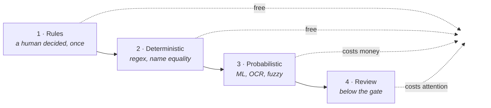
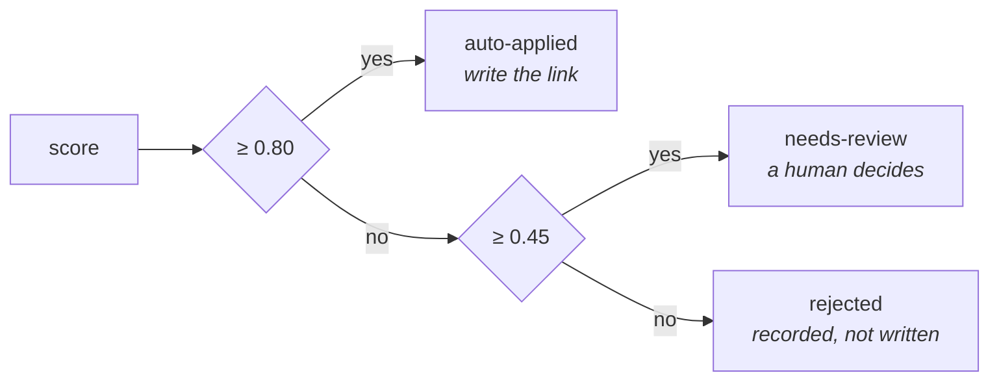
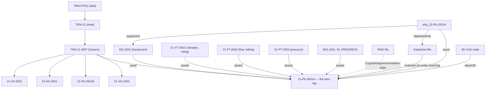

# Chapter 17 — Cross-Cutting Mastery

**Goal:** step back from individual resources and see the system: why every handler
you wrote is safe to re-run, how to debug any of them when something's wrong, what
this course costs at cohort scale, the one picture that makes the whole graph click,
and how to leave cleanly.

---

## 17.1 [INFO] When to use Transformation vs Function vs Workflow vs UI

| Tool | Use when |
|---|---|
| **Transformation** | Clean, deterministic RAW → model key mapping (section 5.1) |
| **Function** | Fuzzy/ML/job-based/multi-step logic; anything calling an async CDF job API |
| **Workflow** | You need to encode order, parallelism, retries, and failure policy across multiple Transformations/Functions as one deployable resource |
| **UI (Fusion)** | Verifying every step above, and one-off manual inspection — never your primary deployment mechanism |

---

## 17.1b [INFO] Contextualization — one framework, four capabilities

You have now done contextualization four times, with four different APIs. They look like
four topics. They are one, and seeing that is the difference between someone who can call
the APIs and someone who can design a pipeline.

### Every one of them is the same ladder



| Chapter | Rung 1 — rules | Rung 2 — deterministic | Rung 3 — probabilistic | Rung 4 — review |
|---|---|---|---|---|
| 07 documents → assets | `MappingRules` table | regex on file name | Entity Matching | `below_threshold` |
| 08 P&ID → assets | `TagAliases` table | exact tag text | fuzzy match, OCR | `status: Suggested` |
| 09 CAD → assets | `Model3DMappings` table | name equality | *(none — you decide)* | `cad_nodes_unclaimed` |
| 10 datasheet → specs | *(none needed)* | regex per template | Document Parser | fields that came back empty |

⚡ `[OPTIMIZE]` **Spend in that order, always.** A rule is free and certain. A regex is free
and predictable. A model costs a fit, a predict, polling, and a threshold you have to
defend. Attention is the most expensive thing in the list, so protect it: only what
survives the first three rungs should ever reach a human.

### Rules are data, not code — in all four

Three RAW tables, one shape:

| Table | Chapter | Decides |
|---|---|---|
| `rwt_Training_TRN_MappingRules` | 07 | this document belongs to that asset |
| `rwt_Training_TRN_TagAliases` | 08 | `PMP` and `P` both mean `PUMP` |
| `rwt_Training_TRN_Model3DMappings` | 09 | `DECK` is the separation train |

Every one carries `addedBy` and `reason`. Neither does anything technically, and without
them a mapping table becomes untouchable within a year — everyone can see *what* it does
and nobody dares say whether it is still true.

💡 `[GOOD TO KNOW]` The reason this matters is organisational, not technical. **The person
who knows that `DECK` is the separation train is almost never the person who can deploy a
Cognite Function.** Put the rules in code and you have made a drawing-office engineer wait
on a release. Put them in RAW and they fix it themselves —
[Chapter 16](16-access-management.md) is how you grant exactly that and nothing more.

### The three questions to ask about any new capability

When CDF ships something you have not seen, or a vendor offers you a matching tool:

1. **What does it match on?** Text, shape, geometry, numbers? That decides whether your
   input is even eligible — Full diagram parsing is useless on a scanned P&ID
   ([Chapter 08](08-diagram-annotation.md) section 8.3b).
2. **What does a wrong answer cost?** A wrong link is worse than a missing one, because
   nobody audits a relationship that already exists.
3. **Where does the gate live, and who watches it?** A confidence threshold with no review
   queue behind it is not a gate, it is a shrug.

⚠️ `[COMMON MISTAKE]` Reaching for the newest capability first. [Chapter 10](10-datasheet-parsing.md)
ships deterministic regex rather than the Document Parser API, deliberately, because an
unattended job's first duty is to be predictable. **Newest is a reason to evaluate, never
a reason to deploy.**

---

## 17.1c [INFO] The production spine — runs, suggestions, bands and gates

Everything so far writes **the answer**. `file.assets` gains a reference; the P&ID gains an
edge. That is enough to demo and not enough to operate, and the gap shows up as four
questions you cannot answer:

> *When did that link appear? Which rules produced it? Somebody approved this last
> month — will tonight's run undo it? Is contextualization getting better or worse?*

Two extra records fix all four. They cost you two containers.

### `ContextualizationRun` — one row per execution

Run ID, technique, status, rules version, timestamps, and the counts that matter:
`scanned`, `applied`, `review`, `rejected`, `unresolved`, `staleRemoved`, `failed`. Plus
the `workflowExecutionId`, so a bad link traces back to the pipeline run that made it.

💡 `[GOOD TO KNOW]` A run still marked `running` an hour later is **itself a finding**. A
record with no completion is how you discover a Function that died silently — which no
amount of looking at `file.assets` will ever tell you.

### `ContextualizationSuggestion` — one row per proposed link

Source, target, **method** (which rung), **confidence**, **evidence** (the text matched,
the page, the locator), and the **decision** with who made it.

⚡ `[OPTIMIZE]` `method` and `evidence` are what make a review queue possible. A reviewer
handed *"file X → asset Y, 0.62"* has to redo your work. Handed *"matched the text
`21-PA-2001A` on page 3 at that bounding box"*, they answer in seconds.

### Three bands, not one threshold



⚠️ `[COMMON MISTAKE]` One threshold. It forces every uncertain match into one of two wrong
answers — apply it silently, or throw it away with no trace. **The middle band is where
contextualization actually lives**, and a rejected match is still worth recording: *"we
looked and were not sure"* is information, and discarding it is how a backlog becomes
invisible.

🚧 `[LIMITS]` Those two numbers are **calibrated, not chosen**. Label a few dozen pairs by
hand, measure precision at several cut-offs, and set `AUTO_APPLY_AT` where precision meets
what your use case can tolerate. A number somebody picked because it felt about right is
not a gate, it is a shrug.

### Two identity decisions carry the whole design

A **run** is keyed by its run ID. Every execution adds one, and none is ever modified —
that is the history.

A **suggestion** is keyed by `(source, target)`. Run seventeen updates the same node run
one created — that is the *current state* of one proposal, not a log of it.

⚠️ `[COMMON MISTAKE]` Keying suggestions by run as well, because it feels more auditable.
What you get is an ever-growing pile in which this morning's approval is indistinguishable
from a stale proposal nobody has looked at since March, and a review queue that grows
every night whether or not anyone works it. The run records are the audit trail; the
suggestions are the working set.

### The two rules that make a pipeline safe to re-run

> **1. A person's decision outranks the machine's — on every rung, every run.**

The handler loads the existing suggestions *before* it does anything, and refuses to
overwrite a node whose `decidedBy` is anybody but `pipeline`. Note **every rung**: it is
tempting to apply this only to the model's output, on the grounds that a deterministic
rule is authoritative. It is not. A rule is only *cheaper* than a person who looked at the
link and said no. A vetoed pair is also never escalated to a paid rung — re-proposing
something a person already rejected, and paying for the privilege, is the worst of both.

Get this wrong once — silently reverse an approval somebody made this morning — and they
stop trusting the system permanently. There is no second chance at that.

> **2. Silence is not agreement.**

A pair the pipeline applied last week and does not produce today is a **change**, not an
absence. Somebody edited a rule, or a source name moved. The handler compares what it just
produced against what it finds already recorded, marks the difference `superseded`
(counted as `supersededCount`), **and takes the link back off `file.assets`** (counted as
`staleRemovedCount`).

Both halves are required. Marking a suggestion superseded while leaving the link in place
means the record says one thing and Fusion shows another, and the graph accumulates links
nobody can justify. The same applies to a human rejection: recording it and not un-linking
means the reviewer did the work, the record says "rejected", and the bad link is still
there.

💡 `[GOOD TO KNOW]` Note the asymmetry in what each retraction is allowed to touch. A
**person's** rejection removes the link whoever created it — they looked at this exact
pair and said no. A **pipeline** retraction only removes what the pipeline itself applied,
which is knowable *only* because the suggestion recorded `decidedBy`. Without that record
the safe implementation is to remove nothing, and the links accumulate forever. This is
provenance doing real work, not paperwork.

🚧 `[LIMITS]` A run whose `staleRemovedCount` suddenly jumps is the single highest-value
alert in this whole chapter. It is what a broken rule, a renamed source system or a bad
deploy looks like from the outside — *hours* before anyone notices links have gone
missing in Fusion. Leave that count unwatched and you find out from a user instead.

✅ `[VERIFY]` Ask the graph how the last run went, and what is waiting for a human:

```python
from cognite.client.data_classes.data_modeling import ViewId
from cognite.client.data_classes import filters as flt

RUN = ViewId(SDM_SPACE, "ContextualizationRun", MODEL_VERSION)
SUG = ViewId(SDM_SPACE, "ContextualizationSuggestion", MODEL_VERSION)

runs = client.data_modeling.instances.list(sources=RUN, space=INSTANCE_SPACE, limit=-1)
for r in runs:
    p = r.properties[RUN]
    print(f"{p['runId']}  {p['status']}  applied={p.get('appliedCount')} "
          f"review={p.get('reviewCount')} unresolved={p.get('unresolvedCount')}")

queue = client.data_modeling.instances.list(
    sources=SUG, space=INSTANCE_SPACE, limit=-1,
    filter=flt.Equals(SUG.as_property_ref("decision"), "needs-review"))
print(f"\nwaiting for a human: {len(queue)}")
```

### The quality gate

A count is not a gate until something **fails** on it. The last task in your workflow
should assert the numbers and go red when they are wrong:

```python
assert run["failedCount"] == 0, "items errored -- this is a bug, not data quality"
assert run["status"] == "completed", "the run never finished"
assert run["unresolvedCount"] <= 2, f"too many unresolved: {run['unresolvedCount']}"
assert run["reviewCount"] <= 10, "review backlog is growing faster than it is cleared"
```

💡 `[GOOD TO KNOW]` Note which of those is *not* a data-quality check. `failedCount` and a
missing `status` are **bugs** — code that threw, or a job that died. Unresolved and review
counts are the business signal. Conflating them is how a crashing pipeline gets explained
away as "the data is messy this week".

---

## 17.1d [OPTIMIZE] Reads lag writes — the race that makes a gate lie

`instances.apply()` returning success does **not** mean the next reader sees the data.

Measured on this project, five writes, timed from `apply()` returning to the instance
being visible:

| Read path | min | max | mean |
|---|---|---|---|
| `instances.retrieve()` by ID | 0.58 s | 2.15 s | 1.01 s |
| visible to `instances.list()` | 0.83 s | 2.39 s | 1.26 s |

RAW, for comparison, was under a second for both a delete and an insert to become
visible to `rows.list()`.

Two seconds sounds like nothing. It is not, because of *where* it lands.

⚠️ `[COMMON MISTAKE]` A Workflow whose next task reads what the previous task wrote.
That is not a rare edge — it is the shape of every pipeline in this chapter. The quality
gate in [Chapter 12](12-workflows.md) reads the `ContextualizationRun` record that
`match_documents` wrote *moments* earlier. Write it naively and it reads the **previous**
run, passes on last night's healthy numbers, and reports green for a run it never looked
at. Nothing errors. Nothing is red. The gate is simply not a gate any more.

This is worse than a flaky test, because it fails in the safe-looking direction: a gate
that races usually still passes, so you find out the first time it was supposed to catch
something and did not.

✅ `[VERIFY]` Two defences, and the Function uses both:

```python
# 1. Poll rather than assume -- a bounded wait, never an unbounded one.
deadline = time.time() + 30
while True:
    runs = client.data_modeling.instances.list(sources=run_view, space=space, limit=-1)
    ...
    if candidates:
        break
    if time.time() >= deadline:
        raise QualityGateFailed("the run being gated never wrote a record")
    time.sleep(1)
```

```python
# 2. Pin to identity, not to recency. A caller that knows the run ID passes it, so
#    "the latest run" can never quietly mean "some earlier run".
call(external_id="fnc_..._QualityGate", data={"runId": run_id})
```

💡 `[GOOD TO KNOW]` Notice which defence does the real work. Polling only buys time; if
the gate is still reading "the most recent run" it can satisfy itself with the wrong one
the instant one exists. **Pinning to the run ID is what makes the check correct** — the
poll just stops it from being flaky while it waits for the right record to land.

🚧 `[LIMITS]` A bounded wait, always. An unbounded `while True` in a Function does not
hang politely: it burns the wall-clock limit and is killed with no result, no error you
can read, and no cleanup — the failure mode [Chapter 07](07-entity-matching.md) warns
about for entity-matching jobs, in a different costume.

---

## 17.2 [INFO] Idempotency & re-runnability — why every handler upserts

Look back across every handler you wrote: `client.data_modeling.instances.apply(...)`
is **always** an upsert, never "create, and error if it already exists." Every
transformation sets `conflictMode: upsert` + `ignoreNullFields: true`. This isn't
incidental — it's the property that makes it *safe to run the workflow again* without
first checking "did this already run?"

⚠️ `[COMMON MISTAKE]` — **the state-pointer trap.** If you ever extend this lab with
an incremental sync Function (not part of this course, but a pattern you'll meet in
real projects), the classic bug is advancing a "last synced" checkpoint
*unconditionally* every run — even when the run found nothing new. The next run then
starts from that later point and **silently skips** whatever the source produced in
between, with no error. The fix: only advance a state pointer on **confirmed new work
done**; if a run finds nothing, leave the checkpoint where it was. None of this
course's handlers carry a state pointer (they're idempotent full-recompute instead),
which is exactly why they dodge this bug entirely — worth knowing for the day you
*do* need incremental state.

---

## 17.2b [INFO] Testing a Function without a CDF project

A Cognite Function is the worst possible place to find a logic bug. The edit-to-answer
loop is **six to twenty-five minutes** — build the image, wait for `Ready`, call it, read
the log — and you spend it on a mistake a test would have caught in a millisecond.

Split the handler in two and the problem mostly disappears:

| Part | What it is | How you test it |
|---|---|---|
| **Decisions** | Which rung resolved this file. What band is this score. Is this pair vetoed. What must be retracted | Plain functions of plain data. Unit tests, no CDF |
| **Effects** | `instances.apply`, `entity_matching.fit`, `raw.rows.list` | A live run. There is no substitute |

The handlers in this course are written that way on purpose. `_apply_rules`,
`_band`, `_human_vetoes` and `_retractions` take dictionaries and return values — no
client, no network, no space names. Everything that touches CDF lives in `handle()`,
`_write_and_report` and `_write_spine`.

```python
def test_a_malformed_regex_in_a_data_row_does_not_break_the_pipeline():
    """The moment humans can edit rules, one of them will be `(unclosed`."""
    rules = [
        {"pattern": "(unclosed", "target": "BAD", "matchType": "regex"},
        {"pattern": "good.pdf", "target": "GOOD", "matchType": "exact"},
    ]
    assert _apply_rules(rules, "f1", "good.pdf") == "GOOD"
```

### Fake the client, do not mock the SDK

Where a test does need a client, hand it a small fake — an object with just the methods
under test:

```python
class FakeRaw:
    def __init__(self, tables): self._tables, self.rows = tables, self
    def list(self, db_name=None, table_name=None, limit=None):
        try:
            return self._tables[(db_name, table_name)]
        except KeyError:
            raise RuntimeError(f"table {db_name}.{table_name} does not exist")
```

That fake exists to assert one thing: an absent rule table is a **valid state**, not an
error, because somebody who has not created it yet must still get a working cascade.

⚠️ `[COMMON MISTAKE]` Growing the fake until it mimics the whole SDK. At that point it is
not a test aid, it is a second implementation — with its own bugs, no users, and a
standing invitation to write tests that pass against your fake and fail against CDF.
Keep it thin enough to read in one screen.

🚧 `[LIMITS]` Be honest about what these prove. **Nothing here tests that CDF behaves as
documented.** A test asserting `apply()` merges a list would have passed happily for
months, and been wrong — [section 3.8c](03-data-modeling.md) had to *measure* that, and it
replaces. Unit tests protect your decisions; only a live run protects your assumptions
about the platform. The course runs both on every pull request, and that is the point.

✅ `[VERIFY]` `uv run --group dev python -m pytest tests/ -q` — 41 tests, well under a
second. The ones worth reading first are in `tests/test_quality_gate.py`, because they
answer the question you cannot answer by watching a gate pass: *can it fail?*

---

## 17.3 [INFO] Observability & debugging

| Resource | Where to look |
|---|---|
| Function call | Fusion → Functions → your function → Calls tab → response + logs; or `client.functions.calls.retrieve(...)` / `call.get_response()` / `call.get_logs()` |
| Transformation | Fusion → Transformations → your transformation → run history — check row counts and error messages per run |
| Workflow | Fusion → Workflows → your workflow → execution graph — per-task status, retries, and timing at a glance |
| Diagram-detect job | `POST /context/documentparser/jobs/byids`-style polling — for diagrams specifically, use `client.diagrams.retrieve_detect_jobs(...)` rather than trusting a single job object's cached status |
| Document Parser job | `POST /context/documentparser/jobs/byids` — the rich `status.job` / `status.view` / `status.validation` / `scores` breakdown from [Chapter 10](10-datasheet-parsing.md) |

⚡ `[OPTIMIZE]` — a useful debugging discipline for this whole course: when a
Function's returned dict shows something wrong (a missing field, an empty `matches`
list, an unexpected `status`), **reproduce it in the matching notebook first**, not by
re-deploying the Function with print statements sprinkled in. Every Function in this
course has a notebook sibling that runs the identical logic interactively — use it as
your debugger.

---

## 17.4 [LIMITS] Cost & quota at cohort scale

Per participant, this lab costs roughly:

| Resource | Approx. cost |
|---|---|
| Function image builds | ~5 builds × 2–10 min each |
| Data sets | 1 (archive-only at teardown — never hard-deleted) |
| Spaces | 3 (`isp_*`, two `ssp_*`) |
| 3D revisions | 1 conversion job |
| Entity-matching models | 1 per `MatchDocuments` call (always deleted after — section 7.4) |

🚧 `[LIMITS]` **Multiply by cohort size.** 15 participants × 5 function builds is 75
concurrent-ish image builds if everyone starts Chapter 07 at the same moment — enough
to stall a shared build cluster. **Stagger function deploys across the cohort** rather
than having everyone hit `cdf deploy --include functions` in the same 60-second window.

---

## 17.5 [INFO] The end-state graph — one picture, not a paragraph

Everything you built converges on one hub node: `21-PA-2001A`.



**The aha moment:** `21-VT-2002` rising and `21-FT-2002` falling
([Chapter 11](11-datapoints.md)) corroborate the degraded condition recorded in
`WO-1001` ([Chapter 05](05-transformations.md)) — and now every piece of evidence for
that operational picture (sensors, work order, datasheet, P&ID, 3D position) is reachable
from the same node, in your own isolated space. The graph connects evidence; engineering
judgement still distinguishes correlation, hypothesis and confirmed cause.

🟢 `[ACTION]` Open your location filter ([Chapter 06](06-location-filters.md)) →
`21-PA-2001A` → confirm you can reach every neighbor in the diagram above by clicking
through Fusion, not just by trusting this picture.

---

## 17.5b [LIMITS] What you cannot change later

Some of what you wrote in [Chapter 03](03-data-modeling.md) is now permanent. Knowing
which half is which is the difference between a schema change and an outage.

| Resource | Changing it | Recovery |
|---|---|---|
| **Container** — external ID, removing a property, changing a property's type or attributes | **Breaking.** Not allowed in place | Delete → recreate → **re-ingest every instance**. The data is in the container; dropping it drops the data |
| **View** — external ID, removing a property, changing a property's `source` | **Breaking**, but versionable | Publish a new version, verify it, migrate consumers, retire the old one. No data moves — views are lenses |
| **Data model** — its view list | Versionable | Same pattern. Remember to update every transformation that names the version |
| Adding a **new** *nullable* property to a container, and to a view | Safe, in place | — |
| Adding a **new** *required* (`nullable: false`) property to an existing **view version** | **Blocked**, even with a `defaultValue` | Bump the view version |
| Adding an **index** | Safe, and can be done later | — |

⚠️ `[COMMON MISTAKE]` Assuming a `defaultValue` makes a required property safe to add.
It does not. Verified live — adding `nullable: false` to a live view returns:

```
Cannot add property 'criticality' to view 'WorkOrder/v1.0.0' as it is required.
Bump the view version to make this change.
```

The reasoning is sound once you see it: every existing consumer of `v1.0.0` was written
against a contract without that field, and a default does not change the fact that the
shape changed. **If you need the field now and cannot bump the version, make it
nullable.** That is a real design decision, not a workaround — a required field is a
promise to every reader of the view, and you cannot add a promise retroactively.

⚠️ `[COMMON MISTAKE]` Recreating a container and forgetting to re-map the views that
reference it. You get **HTTP 500s across the whole project** — not a tidy validation
error, a broken Fusion — until the mapping is repaired. If you must recreate a
container, plan the view updates in the same change.

💡 `[GOOD TO KNOW]` This asymmetry is the real argument for the EDM/SDM split in section 3.4.
Containers are physical and rigid; views are cheap and versionable. Put the stability
you need in containers, and let solution views churn.

📚 `[DOCS]` https://docs.cognite.com/cdf/dm/dm_concepts/dm_containers_views_datamodels#container-changes

---

## 17.6 [PR] Self-verification checklist before you open a PR

Run this before Chapter 18. Catch problems yourself first — these are exactly the
checks a reviewer applies after merge.

```python
import os
from cognite.client import CogniteClient
from cognite.client.config import ClientConfig
from cognite.client.credentials import OAuthClientCredentials, OAuthInteractive

def cdf_client(client_name: str = "dm-handson") -> CogniteClient:
    """Same helper as Chapter 07 section 7.3. CogniteClient() with no arguments does NOT
    read .env -- the SDK dropped implicit construction in v8."""
    base   = os.environ.get("CDF_URL") or f"https://{os.environ['CDF_CLUSTER']}.cognitedata.com"
    scopes = [s for s in os.environ.get("IDP_SCOPES", f"{base}/.default").split(",") if s]
    if os.environ.get("LOGIN_FLOW", "interactive").lower() == "interactive":
        creds = OAuthInteractive(authority_url=os.environ["IDP_AUTHORITY_URL"],
                                 client_id=os.environ["IDP_CLIENT_ID"], scopes=scopes)
    else:
        creds = OAuthClientCredentials(token_url=os.environ["IDP_TOKEN_URL"],
                                       client_id=os.environ["IDP_CLIENT_ID"],
                                       client_secret=os.environ["IDP_CLIENT_SECRET"],
                                       scopes=scopes)
    return CogniteClient(ClientConfig(client_name=client_name,
                                      project=os.environ["CDF_PROJECT"],
                                      base_url=base, credentials=creds))

from cognite.client.data_classes.data_modeling import ViewId

client = cdf_client()   # see Chapter 07 section 7.3
name = "<YOURNAME>"
space = f"isp_{name}_TRN"

checks = []

spaces = {s.space for s in client.data_modeling.spaces.list(limit=-1)}
for s in (f"isp_{name}_TRN", f"ssp_{name}_TrainingCore_edm", f"ssp_{name}_MaintenanceInsight_sdm"):
    checks.append((f"space {s}", s in spaces))

ds = client.data_sets.retrieve(external_id=f"dts_{name}_Training_TRN")
checks.append(("dataset", ds is not None))

raw_dbs = {db.name for db in client.raw.databases.list(limit=-1)}
checks.append((f"raw db rwd_{name}_Training_TRN", f"rwd_{name}_Training_TRN" in raw_dbs))

for suffix in ("Assets", "Equipment", "TimeSeries", "WorkOrders", "WorkOrderOperations"):
    xid = f"tra_{name}_Training_TRN_Load_{suffix}"
    checks.append((f"transformation {xid}", client.transformations.retrieve(external_id=xid) is not None))

for fn in ("GenerateDatapoints", "Load3DRevision", "DetectDiagramTags", "MatchDocuments", "ParseDatasheet"):
    xid = f"fnc_{name}_Training_{fn}"
    checks.append((f"function {xid}", client.functions.retrieve(external_id=xid) is not None))

checks.append(("workflow", client.workflows.retrieve(external_id=f"wkf_{name}_Training_TRN") is not None))

for view_id, expected in [
    (ViewId("cdf_cdm", "CogniteAsset", "v1"), 8),
    (ViewId("cdf_cdm", "CogniteEquipment", "v1"), 5),
    (ViewId("cdf_cdm", "CogniteTimeSeries", "v1"), 6),
]:
    n = len(client.data_modeling.instances.list(instance_type="node", sources=[view_id], space=space, limit=-1))
    checks.append((f"{view_id.external_id} count == {expected}", n == expected))

# CogniteActivity holds BOTH your work orders and your operations, because
# WorkOrder implements it (Chapter 13 section 13.6). Subtract to count operations alone.
wo_view  = ViewId(f"ssp_{name}_TrainingCore_edm", "WorkOrder", "v1.0.0")
act_view = ViewId("cdf_cdm", "CogniteActivity", "v1")
wo_ids = {n_.external_id for n_ in client.data_modeling.instances.list(
    instance_type="node", sources=[wo_view], space=space, limit=-1)}
acts = client.data_modeling.instances.list(
    instance_type="node", sources=[act_view], space=space, limit=-1)
checks.append(("work orders == 3", len(wo_ids) == 3))
checks.append(("operations == 6 (from 8 source rows)",
               len([a for a in acts if a.external_id not in wo_ids]) == 6))

for label, ok in checks:
    print(f"  [{'OK' if ok else 'FAIL'}] {label}")
print("PASS" if all(ok for _, ok in checks) else "FAIL")
```

📋 Also confirm by hand (not scriptable, or not worth scripting for a one-person
check):

- [ ] `ehp_21-PA-2001A` is populated with `openWorkOrderCount == 1` and no glaring
  empty rated-spec fields
- [ ] Your location filter shows only your own 8 assets
- [ ] At least one `CogniteDiagramAnnotation` edge exists on your P&ID
- [ ] Your entity-matching model from Chapter 07 is confirmed **deleted**
- [ ] `21-VT-2002` visibly ramps over the last 5 days in the Fusion chart view
- [ ] Your workflow's last execution completed (3D task may show `skipped`)

---

## 17.7 [PR] Teardown literacy

You are not tearing down yet — that happens after your PR is merged and you're done
with the lab for the day, or if you need to reset and start clean. When you get there,
**[Chapter 19 — Teardown](19-teardown.md)** and its companion notebook
(`notebooks/06_teardown.ipynb`) walk the exact sequence: SDK deletes for your global
resources, then `cdf data purge space` for your spaces (instance space first, then
schema spaces; data sets archive, never hard-delete).

⚠️ `[COMMON MISTAKE]` Treating a data set like anything else you can delete. CDF has
**no hard delete** for data sets — the clean end state is *archived*, not gone.

`cdf data purge space` is **manual-confirmation only** by design — you must type the
CDF project name at the prompt, not just `y`. This is a deliberate speed bump on a
destructive, irreversible operation.

---

## Gate

**Do not proceed to Chapter 18 until:**

- The self-verification script above prints `PASS`
- Every item in the manual checklist is checked
- You can explain what makes a handler "idempotent" and name which course pattern
  this lab deliberately avoids needing (the state-pointer trap)
- You know where you'll look first when a Function, Transformation, or Workflow task
  fails, for each of the three
- 📓 You have added your two or three lines for this chapter to `participants/<YOURNAME>/NOTES.md` — **now**, not tonight

→ [Chapter 18 — PR & Merge](18-pr-and-merge.md)
