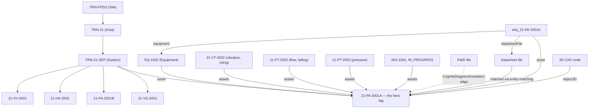

# Chapter 17 — Cross-Cutting Mastery

**Goal:** step back from individual resources and see the system: why every handler
you wrote is safe to re-run, how to debug any of them when something's wrong, what
this course costs at cohort scale, the one picture that makes the whole graph click,
and how to leave cleanly.

---

## 17.1 [INFO] When to use Transformation vs Function vs Workflow vs UI

| Tool | Use when |
|---|---|
| **Transformation** | Clean, deterministic RAW → model key mapping (section 5.1) |
| **Function** | Fuzzy/ML/job-based/multi-step logic; anything calling an async CDF job API |
| **Workflow** | You need to encode order, parallelism, retries, and failure policy across multiple Transformations/Functions as one deployable resource |
| **UI (Fusion)** | Verifying every step above, and one-off manual inspection — never your primary deployment mechanism |

---

## 17.2 [INFO] Idempotency & re-runnability — why every handler upserts

Look back across every handler you wrote: `client.data_modeling.instances.apply(...)`
is **always** an upsert, never "create, and error if it already exists." Every
transformation sets `conflictMode: upsert` + `ignoreNullFields: true`. This isn't
incidental — it's the property that makes it *safe to run the workflow again* without
first checking "did this already run?"

⚠️ `[COMMON MISTAKE]` — **the state-pointer trap.** If you ever extend this lab with
an incremental sync Function (not part of this course, but a pattern you'll meet in
real projects), the classic bug is advancing a "last synced" checkpoint
*unconditionally* every run — even when the run found nothing new. The next run then
starts from that later point and **silently skips** whatever the source produced in
between, with no error. The fix: only advance a state pointer on **confirmed new work
done**; if a run finds nothing, leave the checkpoint where it was. None of this
course's handlers carry a state pointer (they're idempotent full-recompute instead),
which is exactly why they dodge this bug entirely — worth knowing for the day you
*do* need incremental state.

---

## 17.3 [INFO] Observability & debugging

| Resource | Where to look |
|---|---|
| Function call | Fusion → Functions → your function → Calls tab → response + logs; or `client.functions.calls.retrieve(...)` / `call.get_response()` / `call.get_logs()` |
| Transformation | Fusion → Transformations → your transformation → run history — check row counts and error messages per run |
| Workflow | Fusion → Workflows → your workflow → execution graph — per-task status, retries, and timing at a glance |
| Diagram-detect job | `POST /context/documentparser/jobs/byids`-style polling — for diagrams specifically, use `client.diagrams.retrieve_detect_jobs(...)` rather than trusting a single job object's cached status |
| Document Parser job | `POST /context/documentparser/jobs/byids` — the rich `status.job` / `status.view` / `status.validation` / `scores` breakdown from [Chapter 10](10-datasheet-parsing.md) |

⚡ `[OPTIMIZE]` — a useful debugging discipline for this whole course: when a
Function's returned dict shows something wrong (a missing field, an empty `matches`
list, an unexpected `status`), **reproduce it in the matching notebook first**, not by
re-deploying the Function with print statements sprinkled in. Every Function in this
course has a notebook sibling that runs the identical logic interactively — use it as
your debugger.

---

## 17.4 [LIMITS] Cost & quota at cohort scale

Per participant, this lab costs roughly:

| Resource | Approx. cost |
|---|---|
| Function image builds | ~5 builds × 2–10 min each |
| Data sets | 1 (archive-only at teardown — never hard-deleted) |
| Spaces | 3 (`isp_*`, two `ssp_*`) |
| 3D revisions | 1 conversion job |
| Entity-matching models | 1 per `MatchDocuments` call (always deleted after — section 7.4) |

🚧 `[LIMITS]` **Multiply by cohort size.** 15 participants × 5 function builds is 75
concurrent-ish image builds if everyone starts Chapter 07 at the same moment — enough
to stall a shared build cluster. **Stagger function deploys across the cohort** rather
than having everyone hit `cdf deploy --include functions` in the same 60-second window.

---

## 17.5 [INFO] The end-state graph — one picture, not a paragraph

Everything you built converges on one hub node: `21-PA-2001A`.



**The aha moment:** `21-VT-2002` rising and `21-FT-2002` falling
([Chapter 11](11-datapoints.md)) corroborate the degraded condition recorded in
`WO-1001` ([Chapter 05](05-transformations.md)) — and now every piece of evidence for
that operational picture (sensors, work order, datasheet, P&ID, 3D position) is reachable
from the same node, in your own isolated space. The graph connects evidence; engineering
judgement still distinguishes correlation, hypothesis and confirmed cause.

🟢 `[ACTION]` Open your location filter ([Chapter 06](06-location-filters.md)) →
`21-PA-2001A` → confirm you can reach every neighbor in the diagram above by clicking
through Fusion, not just by trusting this picture.

---

## 17.5b [LIMITS] What you cannot change later

Some of what you wrote in [Chapter 03](03-data-modeling.md) is now permanent. Knowing
which half is which is the difference between a schema change and an outage.

| Resource | Changing it | Recovery |
|---|---|---|
| **Container** — external ID, removing a property, changing a property's type or attributes | **Breaking.** Not allowed in place | Delete → recreate → **re-ingest every instance**. The data is in the container; dropping it drops the data |
| **View** — external ID, removing a property, changing a property's `source` | **Breaking**, but versionable | Publish a new version, verify it, migrate consumers, retire the old one. No data moves — views are lenses |
| **Data model** — its view list | Versionable | Same pattern. Remember to update every transformation that names the version |
| Adding a **new** *nullable* property to a container, and to a view | Safe, in place | — |
| Adding a **new** *required* (`nullable: false`) property to an existing **view version** | **Blocked**, even with a `defaultValue` | Bump the view version |
| Adding an **index** | Safe, and can be done later | — |

⚠️ `[COMMON MISTAKE]` Assuming a `defaultValue` makes a required property safe to add.
It does not. Verified live — adding `nullable: false` to a live view returns:

```
Cannot add property 'criticality' to view 'WorkOrder/v1.0.0' as it is required.
Bump the view version to make this change.
```

The reasoning is sound once you see it: every existing consumer of `v1.0.0` was written
against a contract without that field, and a default does not change the fact that the
shape changed. **If you need the field now and cannot bump the version, make it
nullable.** That is a real design decision, not a workaround — a required field is a
promise to every reader of the view, and you cannot add a promise retroactively.

⚠️ `[COMMON MISTAKE]` Recreating a container and forgetting to re-map the views that
reference it. You get **HTTP 500s across the whole project** — not a tidy validation
error, a broken Fusion — until the mapping is repaired. If you must recreate a
container, plan the view updates in the same change.

💡 `[GOOD TO KNOW]` This asymmetry is the real argument for the EDM/SDM split in section 3.4.
Containers are physical and rigid; views are cheap and versionable. Put the stability
you need in containers, and let solution views churn.

📚 `[DOCS]` https://docs.cognite.com/cdf/dm/dm_concepts/dm_containers_views_datamodels#container-changes

---

## 17.6 [PR] Self-verification checklist before you open a PR

Run this before Chapter 18. Catch problems yourself first — these are exactly the
checks a reviewer applies after merge.

```python
import os
from cognite.client import CogniteClient
from cognite.client.config import ClientConfig
from cognite.client.credentials import OAuthClientCredentials, OAuthInteractive

def cdf_client(client_name: str = "dm-handson") -> CogniteClient:
    """Same helper as Chapter 07 section 7.3. CogniteClient() with no arguments does NOT
    read .env -- the SDK dropped implicit construction in v8."""
    base   = os.environ.get("CDF_URL") or f"https://{os.environ['CDF_CLUSTER']}.cognitedata.com"
    scopes = [s for s in os.environ.get("IDP_SCOPES", f"{base}/.default").split(",") if s]
    if os.environ.get("LOGIN_FLOW", "interactive").lower() == "interactive":
        creds = OAuthInteractive(authority_url=os.environ["IDP_AUTHORITY_URL"],
                                 client_id=os.environ["IDP_CLIENT_ID"], scopes=scopes)
    else:
        creds = OAuthClientCredentials(token_url=os.environ["IDP_TOKEN_URL"],
                                       client_id=os.environ["IDP_CLIENT_ID"],
                                       client_secret=os.environ["IDP_CLIENT_SECRET"],
                                       scopes=scopes)
    return CogniteClient(ClientConfig(client_name=client_name,
                                      project=os.environ["CDF_PROJECT"],
                                      base_url=base, credentials=creds))

from cognite.client.data_classes.data_modeling import ViewId

client = cdf_client()   # see Chapter 07 section 7.3
name = "<YOURNAME>"
space = f"isp_{name}_TRN"

checks = []

spaces = {s.space for s in client.data_modeling.spaces.list(limit=-1)}
for s in (f"isp_{name}_TRN", f"ssp_{name}_TrainingCore_edm", f"ssp_{name}_MaintenanceInsight_sdm"):
    checks.append((f"space {s}", s in spaces))

ds = client.data_sets.retrieve(external_id=f"dts_{name}_Training_TRN")
checks.append(("dataset", ds is not None))

raw_dbs = {db.name for db in client.raw.databases.list(limit=-1)}
checks.append((f"raw db rwd_{name}_Training_TRN", f"rwd_{name}_Training_TRN" in raw_dbs))

for suffix in ("Assets", "Equipment", "TimeSeries", "WorkOrders", "WorkOrderOperations"):
    xid = f"tra_{name}_Training_TRN_Load_{suffix}"
    checks.append((f"transformation {xid}", client.transformations.retrieve(external_id=xid) is not None))

for fn in ("GenerateDatapoints", "Load3DRevision", "DetectDiagramTags", "MatchDocuments", "ParseDatasheet"):
    xid = f"fnc_{name}_Training_{fn}"
    checks.append((f"function {xid}", client.functions.retrieve(external_id=xid) is not None))

checks.append(("workflow", client.workflows.retrieve(external_id=f"wkf_{name}_Training_TRN") is not None))

for view_id, expected in [
    (ViewId("cdf_cdm", "CogniteAsset", "v1"), 8),
    (ViewId("cdf_cdm", "CogniteEquipment", "v1"), 5),
    (ViewId("cdf_cdm", "CogniteTimeSeries", "v1"), 6),
]:
    n = len(client.data_modeling.instances.list(instance_type="node", sources=[view_id], space=space, limit=-1))
    checks.append((f"{view_id.external_id} count == {expected}", n == expected))

# CogniteActivity holds BOTH your work orders and your operations, because
# WorkOrder implements it (Chapter 13 section 13.6). Subtract to count operations alone.
wo_view  = ViewId(f"ssp_{name}_TrainingCore_edm", "WorkOrder", "v1.0.0")
act_view = ViewId("cdf_cdm", "CogniteActivity", "v1")
wo_ids = {n_.external_id for n_ in client.data_modeling.instances.list(
    instance_type="node", sources=[wo_view], space=space, limit=-1)}
acts = client.data_modeling.instances.list(
    instance_type="node", sources=[act_view], space=space, limit=-1)
checks.append(("work orders == 3", len(wo_ids) == 3))
checks.append(("operations == 6 (from 8 source rows)",
               len([a for a in acts if a.external_id not in wo_ids]) == 6))

for label, ok in checks:
    print(f"  [{'OK' if ok else 'FAIL'}] {label}")
print("PASS" if all(ok for _, ok in checks) else "FAIL")
```

📋 Also confirm by hand (not scriptable, or not worth scripting for a one-person
check):

- [ ] `ehp_21-PA-2001A` is populated with `openWorkOrderCount == 1` and no glaring
  empty rated-spec fields
- [ ] Your location filter shows only your own 8 assets
- [ ] At least one `CogniteDiagramAnnotation` edge exists on your P&ID
- [ ] Your entity-matching model from Chapter 07 is confirmed **deleted**
- [ ] `21-VT-2002` visibly ramps over the last 5 days in the Fusion chart view
- [ ] Your workflow's last execution completed (3D task may show `skipped`)

---

## 17.7 [PR] Teardown literacy

You are not tearing down yet — that happens after your PR is merged and you're done
with the lab for the day, or if you need to reset and start clean. When you get there,
**[Chapter 19 — Teardown](19-teardown.md)** and its companion notebook
(`notebooks/06_teardown.ipynb`) walk the exact sequence: SDK deletes for your global
resources, then `cdf data purge space` for your spaces (instance space first, then
schema spaces; data sets archive, never hard-delete).

⚠️ `[COMMON MISTAKE]` Treating a data set like anything else you can delete. CDF has
**no hard delete** for data sets — the clean end state is *archived*, not gone.

`cdf data purge space` is **manual-confirmation only** by design — you must type the
CDF project name at the prompt, not just `y`. This is a deliberate speed bump on a
destructive, irreversible operation.

---

## Gate

**Do not proceed to Chapter 18 until:**

- The self-verification script above prints `PASS`
- Every item in the manual checklist is checked
- You can explain what makes a handler "idempotent" and name which course pattern
  this lab deliberately avoids needing (the state-pointer trap)
- You know where you'll look first when a Function, Transformation, or Workflow task
  fails, for each of the three
- 📓 You have added your two or three lines for this chapter to `participants/<YOURNAME>/NOTES.md` — **now**, not tonight

→ [Chapter 18 — PR & Merge](18-pr-and-merge.md)
